# Locating and retrieving administrative subdivisions for your selected LMIC, as well as plotting boundaries and labelling each local government unit.

## Projecting, Plotting and Labelling Administrative Subdivisions

We have had a bit of practice creating a theoretical environment, but now we will move to a more practical application.  In this exercise you will learn how to **install a package** and **load a library of functions** into R, **install spatial data as a simple feature** and then **use the grammar of graphics** \(aka `ggplot::`\) to plot your geospatial data.  To begin, install a package that will be used in order to describe and analyze our simple features.

```r
install.packages("tidyverse", dependencies = TRUE)
```

In the above command we are installing a collection of packages designed for data science, where all packages share a common design.  Once RStudio has informed you that the package has been installed, you may then execute the command that makes the library function available for use during your current work session.

```r
library(tidyverse)
```

After executing the library command, R may inform you about the current version of attached packages while also identifying any conflicts that may exist.  Conflicts between functions often exist when one package installs a function that has the same name as another function in another package.  Generally, what happens, is the latest package to be installed will mask a same named function from a previously loaded library.

The tidyverse is not one library of functions, but is in fact a suite of packages where each one conforms to an underlying design philosphy, grammar and data structure.  In the previous exercises we used commands from the base R package, but in this exercise we will begin to consider the more recent development of the tidyverse syntax nomenclature that emerged from the gramar of graphics \(ggplot2\).  The [tidyverse](https://www.tidyverse.org/) is arguably a more coherent, effective and powerful approach to data science programming in R.

After installing and loading the `tidyverse` suite of packages, let's install yet another important package that is used when working with spatial data.

```r
install.packages("sf", dependencies = TRUE)
```

This will install the `sf` package,  or [simple features](https://r-spatial.github.io/sf/), which like the tidyverse is a recent, arguably more effective implementation of a design philosphopy for using spatial data in R.  The `sf::` package also has been designed to integrate with the `tidyverse` syntax.  After installing `sf::`, then as before run the `library()` function to load the library of functions contained within the package for use in your current R worksession.

After running the `install.packages()` command successfully, you should add a `#` at the beginning of that line in order to comment it out. Running the `install.package()` command is generally necessary only once, in order to retrieve the package from a remote location and install it on your local machine, but it is necessary to run the `library()` command each time you open R and wish to access a function from within that library.

Another helpful command to add at the beginning of your script is `rm(list=ls(all=TRUE))` , which will delete everything from your R workspace from the outset. By running this line of code first in your script, you will be working with what John Locke called a _tabula rasa_ or a clean slate from the outset. After adding the remove all function as your first line of code but after installing your packages and loading those libraries, be sure to set your working directory. While it's fine to use the drop down menu to find the location of your working directory, the first time, it is a good idea to copy that line of code into your script, so the `setwd()` command can be executed programmatically instead of through the GUI \(which will save you time\). At this point your script should look like the following snippet of code.

```r
rm(list=ls(all=TRUE))

# install.packages("tidyverse", dependencies = TRUE)
# install.packages("sf", dependencies = TRUE)

library(tidyverse)
library(sf)

setwd("the/path/to_my/working/directory")
```

The next step is to visit the [GADM](https://www.gadm.org/) website, which is a repository of spatial data that is describing global administrative subdivisions or every country on earth.  Select the data tab and become familiar with how the portal presents the administrative subdivision of each country.  Find the country link towards the top of the page that forwards you to another page with a drop down tab for downloading GADM data.

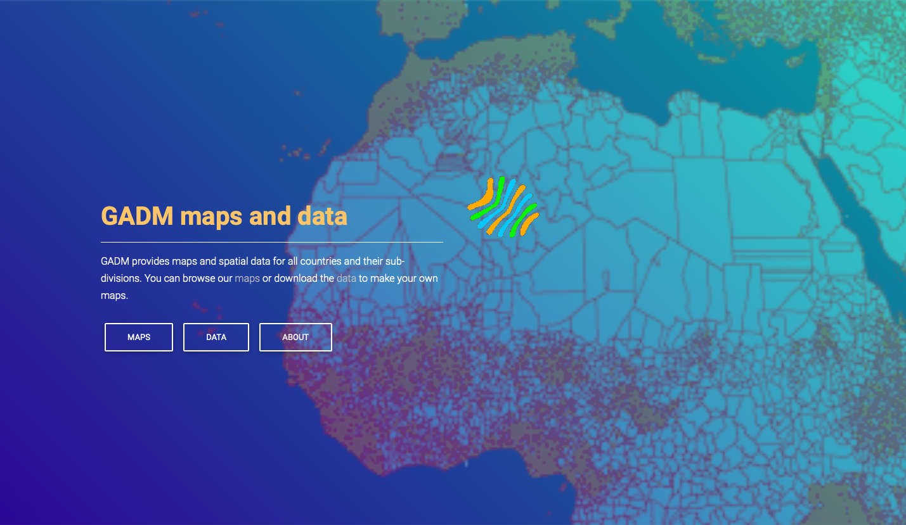

As an example, I will select the West African country of Liberia.  The result should present a number of different options for obtaining a spatial data that describes of **Liberia's administrative boundaries**.  Administrative boundaries refer to the national border as well as all of the regional, district and local government subdivisions of that country.  

Throughout the course of the semester we will use a number of different data sets that  describe healthsites, settlements, roads, population, pregnancies, births, and a number of other local dimensions of human development. Some of the data made available through WorldPop or the Humanitarian Data Exchange will have been **remotely sensed**, usually from a satellite orbitting the earth. This remotely sensed data is then classified according to different discrete types or perhaps by assigning values or intervals of possible values. Other times the data available will have been obtained from a source in the field, and most typically from some institution or group located or working within that particular country. Surveys and census data are examples of **secondary sources** that were most often obtained from local institutions. Like remotely sensed data, secondary sources also serve to provide a description of existing conditions, while serving as the basis for further analysis, modeling, inference and potential simulations.

Typically, administrative boundaries and subdivisions have been obtained and provided by one of the regional offices within the _United Nations Office for the Coordination of Humanitarian Affaris_ \(OCHA\).  For example, the secondary sources of data that describe Liberia's political geography were likely provided by the _Regional Office of West and Central Africa_ \(ROWCA\), presumably as they have obtained these sources from a ministry of government from within Liberia.  Every country employs a unique nomenclature in order to describe its administrative subdivisions.  Liberia is first subdivided into _counties_ with each county further subdivided into _districts_.  Each of Liberia's _districts_ is then further subdivided into what are called _clan areas._

Once you have found the the page for downloading Liberia's administrative subdivisions, note the different available spatial data types, as well as the different levels.    

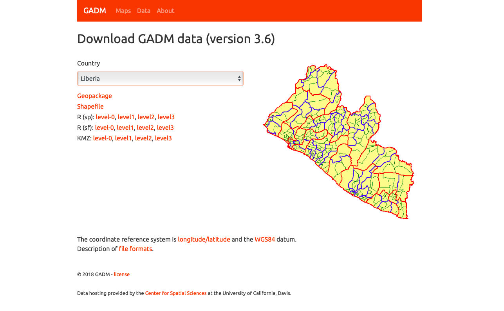

For our purposes, we want to obtain the national boundary \(LBR\_0\), first level administrative subdivisions \(LBR\_1\) and second level administrative subdivisions \(LBR\_2\).  Click on the **Shapefile** link in order to download a folder that contains a shapefile as well as a number of different corresponding files.  After the folders have been downloaded, go to your working directory and create a new folder named **data** and then move the folders describing Liberia's administrative subdivisions to within that folder.  The structure of your working directory should look something like the following \(minus the additional folders\).

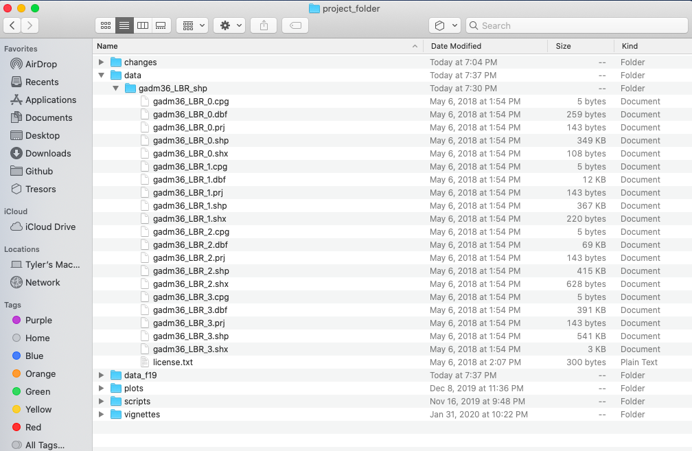

You will also notice that there are a number of different files, each one with the same file name yet also having a unique file extension.  The file extension is the _three letter part of the file name that is to the right of the period_, and acts somewhat as an acronym for the file type.  For example, files that have the `.shp` file extension are called shapefiles.  A shapefile contains the geometry of the points, lines and polygons used to spatially describe, in this example, the political geography of Liberia.  A shapefile also requires most of the other files found in the folder in order for it to function properly.  For example, the `.prj` file provides the projection that is used when plotting the geometry.  The `.dbf` file provides the attributes associated with each spatial unit \(for example the name associated with each county or district\).  Other files also provide information that enables RStudio to further interpret the spatial information in order to better serve our purposes.

In order to import a shapefile into RStudio we are going to use a command from the `sf::` package \(simple features\).  RStudio will need to find each of the `.shp` files in order to import the international border, the first level administrative subdivisions and the second level administrative subdivisions.  If I have set my working directory to the **data** folder, then RStudio will need to traverse through the subfolder in order to locate the correct `.shp` files.  You also will need to use the `read_sf()` command to import the `.shp` file into RStudio and create a simple feature class object.

```r
lbr_int  <- add_command_here("add_folder_here/add_file_name_here.shp")
```

Once you have successfully executed the above function using the `sf::read_sf()` command, you should observe a new object named `lbr_int`appearing in the top right data pane within your RStudio environment.  To the right of your newly created object there is a small gridded box that you will be able to click on in order to view individual attributes associated with this simple feature class spatial object.  You will also notice that within the data pane, RStudio also provides you with some basic information about the object, in this case 1 observation that has 7 variables.

The `sf::` package also includes a function called `st_geometry()` that will enable you to view some of the basic geometry associated with the object you have named `lbr_int`.  Type the name of your object within the `st_geometry()` command so that RStudio will return some basic geometric information about our spatial object that describes Liberia's international border.  You don't necessarily need to write this command in your script, you can just enter it directly into the console


After using the `st_geometry()` command with our `lbr_int` object, RStudio provides us with a basic description that includes the geometry type \(polygons in this case, but it could also return points or lines\), the x & y minimum and maximum values or also known as the bounding box \(bbox\), the epsg spatial reference identifier \(a number used to identify the projection\) and finally the projection string , which provides additional information about the projection used.

Now that we have conducted a cursory investigation of our simple feature object geometry, let's plot our simple features class object that describes the international border of Liberia.  To plot, we will use a series of functions from a package called `ggplot()`.  The gg in the package name `ggplot::` stands for the grammar of graphics, and is a very useful package for plotting all sorts of data, including spatial data classes created with the `sf::` package.  To start add `ggplot() +` to your script and then on the following line add the `geom_sf(data = your_sf_obj)` in order to specify the data that `ggplot()` should use in producing its output.  

```r
ggplot() +
  geom_sf(data = your_sf_obj)
```

Following the `data =` argument, you can also specify the line weight for the border using the `size =` argument.  It is also possible to specify the `color =` as well as the opacity / transparency of your polygon using the `alpha =` argument.  With the following script I have set the international border line weight width to `1.5` , the color of the border to `"gold"` , the fill color for the internal portion of the polygon to `"green"` and the `alpha =`   value to .5 or 50% transparent.


It would also be helpful to have a label describing our plot.  In order to do this we can use either the `geom_sf_text()` command or the `geom_sf_label()` command.  In the following snippet of code you will notice that I have added the aesthetics argument within my `geom_sf_text()` command.  The `aes =` argument enables us to specify which variable contains the label we will place on our object.  If you click on the blue arrow to the left of the `lbr_int` object in the top right data pane, the object will expand below to reveal the names of all variables.  The second variable is named `NAME_0` and provides us with the name we will use as our label, Liberia.  Following the `aes()` argument, you can also specify the `size =` of your label as well as its `color =`.

```r
ggplot() +
  geom_sf(data = your_sf_obj,
          size = value,
          color = "color",
          fill = "color",
          alpha = value_between_0_&_1) +
  geom_sf_text(data = your_sf_obj,
               aes(label = variable_name),
               size = value,
               color = "color")
```

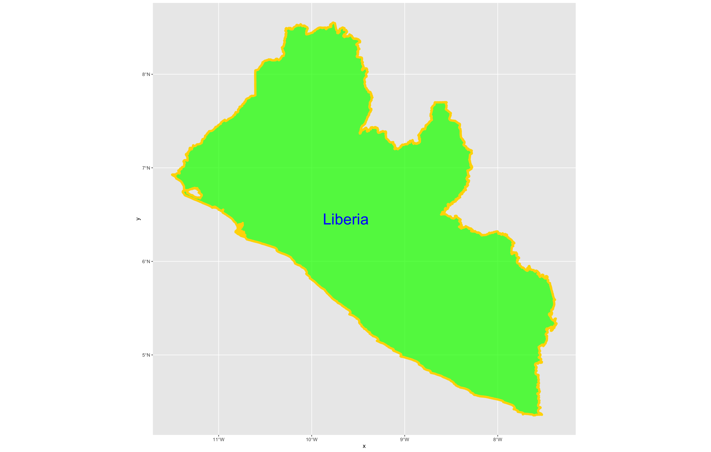

Good job!  You have successfully used ggplot from the tidyverse with the simple features package in order to properly project and plot Liberia's international border, as well as to include a label.  Now continue with the first level of administrative subdivisions, Liberia's fifteen counties.  In order to do this, return to your use of the `read_sf()` command in order to import and create an object named `lbr_adm1`.   

```r
lbr_adm1  <- add_command_here("add_folder_here/add_file_name_here.shp")
```

As before you could use the data pane in the top right corner to expand your view of the `lbr_adm1` file you created.  You can also click on the small grid symbol to the right of your data object \(within the data pane\) in order to view your data in a new tab in the same pane where your script is located.  Whereas before we had a simple feature class object with 1 observation with 7 variables, your `lbr_adm1` simple feature object has 15 observations, with each observation having 8 different variables describing some attribute associated with each individual polygon.  Let's plot both Liberia's international border as well as its 15 counties.

To do this, follow the same approach you used with the `lbr_int` object but replace it with the name of your adm1 spatial object, `lbr_adm1`.  Also follow the same approach you used for adding the labels in your previous snippet of code, but this time specify the variable with the county names from `lbr_adm1`.  

```r
ggplot() +
  geom_sf(data = your_adm1_sf_obj,
          size = value,
          color = "color",
          fill = "color",
          alpha = value) +
  geom_sf(data = your_int_sf_obj,
          size = value,
          color = "color",
          fill = "color",
          alpha = value) +
  geom_sf_text(data = your_adm1_sf_obj,
               aes(label = variable_name),
               size = value,
               color = "color") +
  geom_sf_label(data = your_int_sf_obj,
               aes(label = variable_name),
               size = value,
               color = "color")
```

The code above will produce the plot below when the`geom_sf()` function using the `lbr_adm1` arguments is specified with a line weight `size = 0.65`, line weight `color = "gray50"`, a polygon `fill = "gold3"` and a 65% opacity value of `alpha = 0.65`.  Additionally, I have set the `size = 2.0` , and the `alpha = 0` \(100% transparent\) for the `data = lbr_int` object. The `geom_sf()` command will default to a `color = "black"` if the line color is not specified. Additionally, since the `alpha = 0` no `fill = "color"` is needed \(since it will not appear\). The county labels have a `size = 2` \(and also defaults to a `color = "black"`, while the `geom_sf_text()` command to label Liberia has a `size = 12` argument. In order to nudge the label to the east and south I have also added the `nudge_x = 0.3` and `nudge_y = -.1` arguments to the `geom_sf_label()` command.


After adding the counties go back and add the second level of administrative subdivisions, or districts.  Again use `read_sf()` to import that shapefile as a simple feature object into your RStudio workspace.  Use the  `geom_sf_text()` command to add the labels, while also making sure to specify the correct variable name in the `aes(label = variable_name)` argument.  Size the district borders and labels so they are smaller than the internation border as well as the county delineations.

```r
rm(list=ls(all=TRUE))

# install.packages("tidyverse", dependencies = TRUE)
# install.packages("sf", dependencies = TRUE)

library(tidyverse)
library(sf)

setwd("~/Tresors/teaching/project_folder/data")

lbr_int  <- add_command_here("add_folder_here/add_file_name_here.shp")
lbr_adm1  <- add_command_here("add_folder_here/add_file_name_here.shp")
lbr_adm2  <- add_command_here("add_folder_here/add_file_name_here.shp")

ggplot() +
  geom_sf(data = adm2_object,
          size = value,
          color = "color",
          fill = "color",
          alpha = value) +
  geom_sf(data = adm1_object,
          size = value,
          color = "gray50",
          alpha = value) +
  geom_sf(data = int_object,
          size = value,
          alpha = value) +
  geom_sf_text(data = adm2_object,
               aes(label = variable_name),
               size = value) +
  geom_sf_text(data = adm1_object,
               aes(label = variable_name),
               size = value)

ggsave("liberia.png")
```

Use `ggsave(file_name.png)` to save your plot as a `.png` file, to your working directory.


### Challenge Question

Follow the steps from above that you used to produce your plot of Liberia, but instead each team member should select their own LMIC country and produce the output for it.  Refer this [World Bank](https://datahelpdesk.worldbank.org/knowledgebase/articles/906519) guide for a list of low, middle and high income economies.  Go back to the GADM website and find the administrative boundaries for the LMIC country you have selected.  Plot and label the international border, the first level of administrative subdivisions and the second level of administrative subdivisions.  Make sure you designate heavier line widths for the higher level administrative subdivisions and thinner line widths for the more local governments.  You may also use darker and lighter colors to discern hierarchy.  Please be sure to use different label sizes and/or colors to further differentiate administrative hierarchies.  Modifying annotation transparency also as needed.

Meet with your group and prepare to present the best two plots for the Friday informal group presentation.  Then as a group, upload all 5 team members plots to [\#data100\_project1](https://wmdsi.slack.com/archives/CTJDRU4VC) \(informal group presentations\) by Sunday night.

### Stretch Goal 1

Go to the [HDX](https://data.humdata.org) website, find and download the shapefiles for your selected country.  Compare their administrative subdivisions to those obtained from GADM.  Are they the same?  Are there any differences?  Which source do you think more closely describes the local political reality within your selected LMIC?  Do the HDX shapefiles work?

Alternatively, do the same using the [geoBoundaries](https://www.geoboundaries.org) website, which is housed right here at William & Mary!  When comparing GADM, HDX and geoBoundaries, be sure to identify the source of the data you are presenting.  Are these administrative boundaries primary or secondary sources?  Are you able to identify who produced the data?  How did each repository obtain the data they are sharing with you?

### Stretch Goal 2

Create a new `ggplot() +` as you did before.  This time `filter` your `lbr_adm1` object by using the `%>%` \(pipe\) operator and using the assignment operator to create a new sf object that includes only the county named Montserrado.  Inside the `filter()` command you will need to specify the `admin1name = "Montserrado".` Then continue to use the `%>%` operator with your `lbr_adm2` object again filtering based on the `admin1Name == "Montserrado"` .  Follow that `%>%` with your `ggplot()`, `geom_sf()` and `geom_sf_text()` commands to plot the geometries and labels for both the first and second level administrative subdivisions of Montserrado, Liberia.

```r
new_sf_obj <- lbr_adm1 %>%
  filter(variable == "outcome")
  
lbr_adm2 %>%
  filter(variable == "outcome") %>%
  ggplot() +
  geom_sf(size = value) +
  geom_sf_text(aes(label = variable),
               size = value) +
  geom_sf(data = newly_created_sf_obj,
          size = value,
          alpha = value) +
  geom_sf_text(data = newly_created_sf_obj,
               aes(label = variable),
               size = value) +
  xlab("longitude") + ylab("latitude") +
  ggtitle("Montserrado County", subtitle = "Liberia's most populous county and its subdivisions") +
  theme(plot.title = element_text(hjust = 0.5), 
        plot.subtitle = element_text(hjust = 0.5))

ggsave("montserrado.png")
```


Now identify the most populous urban area within your LMIC and use `ggplot() +` to plot the first and second level administrative subdivisions where it is located.

### Stretch Goal 3

Produce detailed maps of your more densely populated areas and include them in your final product.  Use the `geom_rect() +` command to identify the area of increased scale.  Also use the `annotation_custom() +` command to arrange each plot within a larger graphical layout. The following is a fully working example for Liberia.  Translate the script to your LMIC.  You may need to install and load the package `ggsflabel`.

```r
### Create Larger Map of Liberia with Rectangles identifying area of Detailed Maps

plot1 <- ggplot() +
  geom_sf(data = lbr_adm1,
          size = 0.5,
          color = "gray50",
          fill = "gold3",
          alpha = 0.5) +
  geom_sf(data = lbr_int,
          size = 2.0,
          alpha = 0) +
  geom_rect(data = lbr_adm1, xmin = -10.95, xmax = -10.3, ymin = 6.2, ymax = 6.9, 
            fill = NA, colour = "green", size = 2) +
  geom_rect(data = lbr_adm1, xmin = -8.80, xmax = -7.35, ymin = 4.3, ymax = 5.65, 
            fill = NA, colour = "blue", size = 2) +
  geom_sf_text(data = lbr_adm1,
               aes(label = admin1name),
               size = 3) +
  geom_sf_text(data = lbr_adm1,
               aes(x = -10.60, y = 6.05, label = "Detail A"),
               size = 5,
               color = "green") +
  geom_sf_text(data = lbr_adm1,
               aes(x = -9.10, y = 4.6, label = "Detail B"),
               size = 5,
               color = "blue") +
  xlab("longitude") + ylab("latitude") +
  ggtitle("Liberia", subtitle = "Details A & B") +
  theme(plot.title = element_text(hjust = 0.5), plot.subtitle = element_text(hjust = 0.5),
        panel.background = element_rect(fill = "azure"),
        panel.border = element_rect(fill = NA))

### Create Detail A Map

mont_cnty <- lbr_adm1 %>%
  filter(admin1name == "Montserrado")

plot2 <- lbr_adm2 %>%
  filter(admin1Name == "Montserrado") %>%
  ggplot() +
  geom_sf(size = .15) +
  geom_sf_text(aes(label = admin2Name),
               size = 1.75) +
  geom_sf(data = mont_cnty,
          size = .5,
          alpha = 0) +
  geom_sf_text(data = mont_cnty,
               aes(label = admin1name),
               size = 3.75,
               alpha = .5) +
  xlab("longitude") + ylab("latitude") +
  ggtitle("Detail A", subtitle = "Montserrado County") +
  theme(plot.title = element_text(hjust = 0.5), plot.subtitle = element_text(hjust = 0.5),
        panel.background = element_rect(fill = "azure"),
        panel.border = element_rect(fill = NA))


### Create Detail B Map

east_cnties <- lbr_adm1 %>%
  filter(admin1name == "Grand Kru" | admin1name == "Maryland" | admin1name == "River Gee")

plot3 <- lbr_adm2 %>%
  filter(admin1Name == "Grand Kru" | admin1Name == "Maryland" | admin1Name == "River Gee") %>%
  ggplot() +
  geom_sf(size = .15) +
  
  geom_sf_text(aes(label = admin2Name),
               size = 1.75) +
  geom_sf(data = east_cnties,
          size = .5,
          alpha = 0) +
  geom_sf_text(data = east_cnties,
               aes(label = admin1name),
               size = 3.75,
               alpha = .5) +
  xlab("longitude") + ylab("latitude") +
  ggtitle("Detail B", subtitle = "River Gee, Grand Kru & Maryland Counties") +
  theme(plot.title = element_text(hjust = 0.5), plot.subtitle = element_text(hjust = 0.5),
        panel.background = element_rect(fill = "azure"),
        panel.border = element_rect(fill = NA))


ggplot() +
  coord_equal(xlim = c(0, 6.0), ylim = c(0, 4), expand = FALSE) +
  annotation_custom(ggplotGrob(plot1), xmin = 0.0, xmax = 4.0, ymin = 0, 
                    ymax = 4.0) +
  annotation_custom(ggplotGrob(plot3), xmin = 4.0, xmax = 6.0, ymin = 0, 
                    ymax = 2.0) +
  annotation_custom(ggplotGrob(plot2), xmin = 4.0, xmax = 6.0, ymin = 2.0, 
                    ymax = 4.0) +
  theme_void()

ggsave("details.png")
```


## Extracting Populations from a Raster and Aggregating to each Unit

Now that you have selected your LMIC and produced a basic geospatial description of that country at both the adm1 and adm2 levels of government, you are now set to join some data to each of those units and begin conducting a basic descriptive analysis.  Start by going back to the [WorldPop](https://www.worldpop.org) website, click on the **population** tab under the **data** pull down menu, search individual countries and type the name of your selected LMIC.  Click on the 2019 data and resources tab for your country and then select the download button in order to obtain the spatial distribution of population for your selected LMIC.  For Liberia the downloaded file is named **lbr\_ppp\_2019.tif**.  Move the file to the data folder within your working directory.

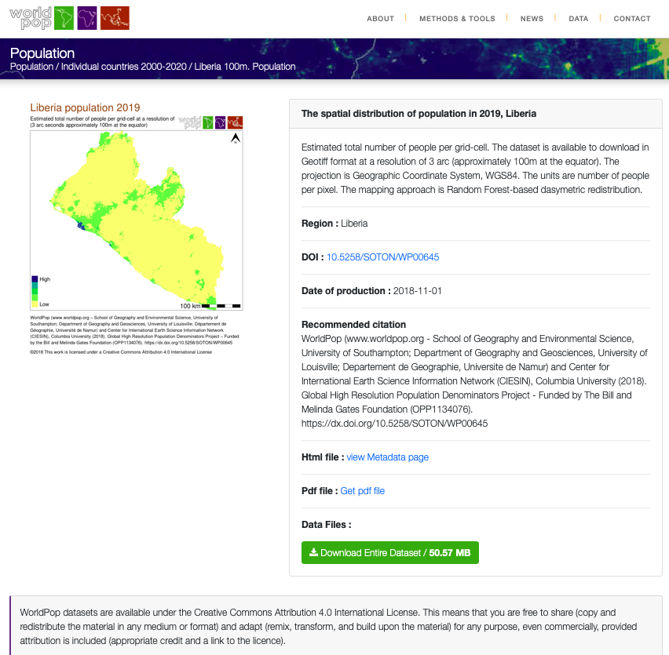

You may need to right click or two finger click and choose the **download linked file** option in order to initiate the process of downloading the `.tif` file into your downloads folder.  Sometimes your web browser may be set to try and display the image file directly within the browser itself.  You should still be able to save the file directly to your downloads folder by right clicking on it and saving it.

After you have succesfully downloaded the file, go to your project folder that you previously used as your working directory and create a new folder within the `/data` folder that will be dedicated to raw data from worldpop.  I have made a subdirectory within my `data` folder named `world_pop` to further categorize and organize my source data.

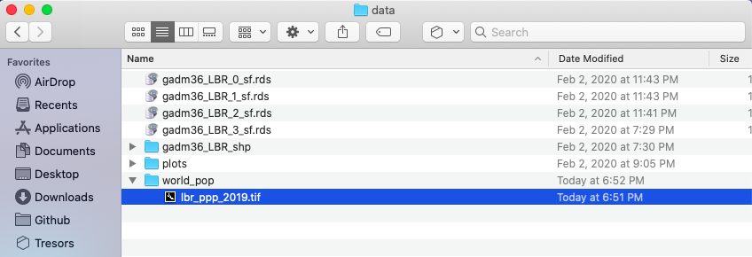

Once you have your `.tif` file located within a subdirectory of the data folder, you can go ahead and open up RStudio.  Create a new, R Script file, and save it in your scripts folder.  Add the `rm(list=ls(all=TRUE))` at the beginning of your code and then load the `tidyverse` and `sf` libraries.  Following your libraries, be sure to set your working directory.

```r
rm(list=ls(all=TRUE))

# install.packages("tidyverse", dependencies = TRUE)
# install.packages("sf", dependencies = TRUE)

library(tidyverse)
library(sf)

setwd("~/path/to_my/working/directory/")
```

For this exercise, we will install a new package and then load its library of functions.  Use the `install.packages()` to install the `raster::` package.  Be sure to set the `dependencies = TRUE` argument within your command.  After you have successfully installed the `raster::` package, use the `library()` function to load `raster::` and make its set of commands available as part of your current RStudio work session.

The first command we will use from the `raster::` package shares the same name as the library itself.  We use the `raster()` function to import our `.tif` file from its location within our data subdirectory to the current RStudio work session.  Keep in mind, if you set your working directory to the `/data` folder, but then also created a subfolder named `/world_pop` you will need to include the subdirectory path, as well as the full name of the `.tif` within the `raster()` command.

```r
myLMIC_raster_pop19 <- add_command_here("add_folder_name_here/add_file_name_here.tif")
```

Once you have created your new raster object, by using the `raster()` function, you should notice a new _Formal class RasterLayer_ data object appear in the top right data pane.  In order to find out some basic information about my newly created raster object, I will type the name of my object directly into the console.


The name of my raster class object is `lbr_pop19` and by typing the objects name directly into the console, R informs me of the class of the object, dimensions, resolution, extent, coordinate reference system as well as the minimum and maximum values.  The information about the objects dimensions can be useful, since it is informing us of how many rows of gridcells by how many columns of gridcells are contained within the object.  In the case of the WorldPop raster layer describing Liberia's population in 2019, the object contains 24,922,800 gridcells of equal size, each one with a value describing how many people live in that location.  Resolution informs us of the size of each grid cell, which in this case is defined in terms of decimal degress.  We can also, obtain additional information about the projection of the raster layer from the crs row, which is in longitude and latitude \(decimal degrees\) while using the WGS84 datum.  We will want to confirm that our shapefiles also are using the WGS84 datum in their projection.

You'll want to note the number of gridcells that your raster layer contains.  If your country contains too many gridcells the computational expense required to execute calculations may be too time intensive.  As noted above, Liberia has about 25 million gridcells, while quite large, most modern desktop and laptop computers should be able to handle this data within a reasonable amount of time.  Comparatively, Ghana has about 41 million, Syria has about 48 million while Cuba has about 53 million total gridcells.  While a bit larger in size than Liberia as well as the computational power that will be demanded in order to execute calculations over those raster files, countries of this approximate size \(40 to 50 million gridcells\) should also be manageable.  Raster files containing more than 50 million gridcells will begin to become exorbitantly more time intensive.  For example, South Sudan with 140 million, Madagascar with 143 million, Morocco with 144 million, or Vietnam with 156 million gridcells per raster will all likely be computationally very expensive in terms of the time it will take to execute commands using the raster files.

If your country has a very large number of gridcells within the population raster, there are two recommendations for how to proceed.  First you are welcome to reselect your LMIC by choosing one that is smaller in terms of area and number of gridcells.  Second, you are also welcome to select a subdivision of your LMIC and then subset your country to include only that administrative area.  A good example of how to subset your LMIC to include one or more of its subdivisions was provided in project 1, part 1, [individual stretch goal 2](https://tyzao.gitbook.io/geodatasci/descript_pop/intro_spatdata#individual-stretch-goal-2) \(lines 1 & 2 of the code\).  If you want to subset a larger country and raster, please ask me, and I'll share some example code with you.

As we  did in the previous exercise, we will again import our shapefiles using the `read_sf()` command from the `sf::` library of functions.  Let's start out by importing the adm1 shapefile for your selected LMIC.

```r
myLMIC_sf_adm1  <- add_command_here("add_folder_here/add_file_name_here.shp")
```

In a manner similar to how we retrieved a basic description of our raster file, we can simply type the name of our simple features class object into the console.

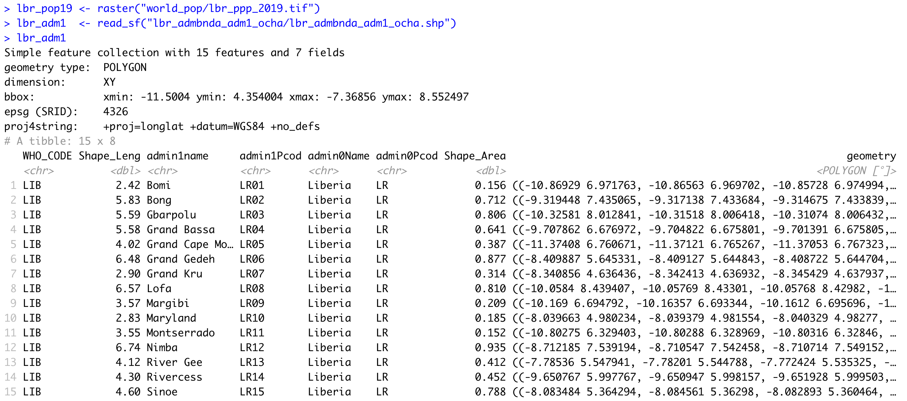

R informs us that our simple feature collection has 15 features, each one with 7 fields \(or variables\).  R also provides us with the bounding box for our collection of polygons in terms of the minimum and maximum longitude and latitude values.  Additionally, we are able to confirm that the source shapefile used to important our sf object also used the WGS84 datum for projection.

You also may notice that below the proj4string row, R describes the object as a tibble: 15 x 8.  A **tibble** is a new object class for data that is commonly used with the tidyverse syntax.  **Tidyverse** syntax is sometimes referred to as **tidyR** and is different from the baseR syntax.  While tidyR is fully capable of calling variables from data frames using either the `$` operator or the `[ ]` subscripting operators, it is a more advanced design in its approach to data that can include multiple dimensions, and thus `%>%` pipe operators can be very effective.  For now, all you need to know is that a **tibble** is a kind of data object, and **tidyR** is a new kind of data science syntax for R.

Since both our `raster` and `sf` objects are similarly projected, we should be able to plot both and confirm they have the same bounaries.  Start by plotting the `raster` object.  Follow that on the next line, by also plotting your `sf` object.  You will want to nest the name of your `sf` object within the `st_geometry()` command in order to plot just the geometry for all 15 polygon features.  Finally, also include the `add = TRUE` argument to the command, in order to add the ploygon features to the already plotted raster layer.

```r
plot(your_raster_object)
plot(st_geometry(your_adm1_sf_obj), add = TRUE)
```


We can see that we now have a scale on the right hand side of the plot that is using a color scale to coorespond with all continuous values between a minimum and maximum \(from about 0 to a little more than 112\).  We can also begin to identify the locations throughout Liberia where people have settled.  Clearly there is a large clump of green and yellow gridcells located along the southern coast \(this is the location of Liberia's capital city Monrovia\).  As we move away from the centrally populated coastal urban area, inland to the north-east we also notice some less densely populated areas along the outskirts of Monrovia, which have pinkish colored gridcells.  There are also a few, less populated urban areas further to the south as well as along the northern border with Guinea.  In fact, if we looked at all 24,922,800 gridcells that indivually comprise this map, each one would have a value and cooresponding color that indicates its population.

We can confirm that our `raster` and `sf` objects have almost coterminous boundaries \(not exactly, but fairly close\).  Now we will use a function from the `raster::` package that will evaluate each gridcell according to its location, which will be one of the 15 counties.  Since we have 24,922,800 gridcells to evaluate in accordance with one of 15 different locations, we can imagine this could very well be a computationally expensive task.  Before executing your extract command, it is a good idea to close all applications and processes that you may have running on your desktop or laptop.  It is also a good idea to connect your computer to a power supply cable that is plugged into a 110V wall jack.  Restarting your computer from a cold boot and confirming that no superfluous processes automatically begin during start-up, will also help to maximize your potential computational power for RStudio. 

In order to optimize the efficiency of your computer, we are also going to do something called _parallel processing_ by sending streams of data to available cores found in the central processing unit of your computer.  To do this, we will need to add two new packages in your script.  Go back to the top of your script and add a line of code beneath the other lines where you executed the `install.packages()` command.  This time, install two new packages, `doParallel::` and `snow::`.  Add the `dependencies = TRUE` argument to inform RStudio to include any other packages that `doParallel::`and `snow::` may depend upon in order to properly function.  After you have sucessfully installed both packages \(always observe their installation and watch to see if any errors pop up\), then use the `library()` command in order to load each packages' associated library of functions.  Don't forget to comment off the `install.packages()` lines of code after they have finished.

Once you have successfully made both of these new packages available, move back to after the last lines of code you wrote, where you plotted your `raster` layer with the `sf` layer on top.  First, check to see how many cores are available on your computer.  To do this use, enter the `detectCores()` command directly into the console.  When running parallel processes on your computer, you should always save at least one core for system operations, thus we will create an object that is equal to the number of cores on your computer - 1.  

In the next steps that follow, **do not** execute any of the following four lines of code until you have first properly specified them in your script \(I'll indicate when to run them further below\).  Start by creating an object that designates the number of cores you will use once you begun parallel processing.  Follow the creation of your `ncores` object with the `beginCluster()` command, which will inform RStudio to start parallel processing.

```r
ncores <- detectCores() - 1
beginCluster(ncores)
```

Once parallel processing has been engaged, we will add the command from the `raster::` package that will evaluate all of the gridcells and assign a number to each one that cooresponds to its location as being within one of the 15 counties.  This command is called `extract()`.  The `extract()` command will need two objects, the first will be our raster layer object while the second will be our simple features class object.  In addition to adding the `extract()` command itself to the script, I will also further specify the `raster::` library in the command to make certain, RStudio doesn't attempt to execute a different `extract()` command from another library.  Do not run this command yet, just write it in your script after `beginCluster()`.

```r
pop_vals_adm1 <- raster::extract(your_raster_obj, your_sf_obj, df = TRUE)
```

Also add the `df = TRUE` argument at the end of the command to create the new object as a data frame.  Following the `extract()` command, add the `endCluster()` command, to inform RStudio that you will no longer need to use additional cores for parallel processing.  This snippet of code should appear as follows.  Select all four lines and run them at the same time.

```r
ncores <- detectCores() - 1
beginCluster(ncores)
pop_vals_adm1 <- raster::extract(lbr_pop19, lbr_adm1, df = TRUE)
endCluster()
```

Depending on your computer, the size of the `raster` file as well as the size of your `sf` file, running the above 4 lines of code could take a few minutes.  You will want to be patient and wait for the `extract()` command to complete its evaluation of every grid cell.  If you would like to monitor the progress of your comptuer you could go to the activity monitor on a Mac or the task manager on a Windows machine.  


For example on this particular Mac, you will see that 7 processes have been allocated to R in order to evaluate the location of all ~25 million gridcells.  You will also notice the CPU load has increased considerable, to almost 90% in the above case.  With 7 i7 cores, it took about 1 minute and 10 seconds to extract the values of all 4 million persons distributed across the 25 million gridcells throughout Liberia.  Your case could be faster or slower depending on the size of the data, the speed of your machine, and how much computational power you have reserved for the given task.

After your `raster::extract()` has finished, you should have a new data frame object in your top right data pane that is populated with probably hundreds of thousands if not millions of rows \(observations\), and two columns \(variables\).  Each row will have a number between 1 and 15 in the above case \(each number corresponding to each of Liberia's counties\) and then a following column that provides the WorldPop estimate for how many people occupy each individual gridcell.  You may notice that all of the observational values have fractions and even quite a large number are likely to be a fraction less than 1.  While not an ideal outcome, these fractions are a result of the current methodology and essentially is still state of the art for dasymmetric population distribution.  In the future, I expect new methodologies will discretize intervals and over come this "zero cell problem" by some means other than adding these small values across the entire space that essentially amount to "noise."

Since this newly created data frame is quite large, and it would be better if you didn't have to run the `extract()` command everytime you opened and ran this script, it is a good idea to go ahead and save the data frame as a `.RData` file.  You can save data using the `save()` command, and then you can also later load data using the `load()` command.  Once you have executed the `save()` command, you can then comment it off, thus only needing to `load()` the data.

```r
# ncores <- detectCores() - 1
# beginCluster(ncores)
# pop_vals_adm1 <- raster::extract(lbr_pop19, lbr_adm1, df = TRUE)
# endCluster()
# save(pop_vals_adm1, file = "pop_vals_adm1.RData")

load("pop_vals_adm1.RData")
```

We have assigned a cooresponding ID for each gridcell according to its county, and now we will sum the totals all gridcells by ID.  Start with the data frame that you created with your `extract()` command.  For my Liberia example, I have called the data frame object `pop_vals_adm1`.  Follolw your object with the `%>%` pipe operator.  You will use the `group_by()` command in order to group all of the observations within our data frame according to its `ID`.  Follow the `group_by()` command again with another `%>%` pipe operator.  Now specify that you will group each row according to its `ID` and also summarize all of the rows with the same `ID` according to the `lbr_ppp_2019` variable, which contains the estimate of how many persons live within each gridcell.  Finally, be sure to add the `na.rm = TRUE` argument to your command, which will remove from the calculation all grid cells that do not have a value \(generally designated in R as NA\).

```r
totals_adm1 <- pop_vals_adm1 %>%
  group_by(add_ID_variable_here) %>%
  summarize(name_of_newly_created_var = sum(add_pop_var_here, na.rm = TRUE))
```

Grouping the data frame we produced with the `extract()` function, by `ID` while also summing together all gridcell values that share that same `ID` will produce the following estimated population totals for every county in Liberia.  

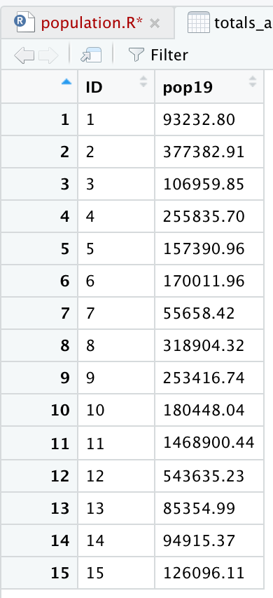

Review the sum totals to see if they are realistic.  Execute the equivalent of  `sum(totals_adm1$pop19)` directly in the console, and consider the total returned.  In the above example, R returns a total of 4,288,144 total persons living in 15 different counties across Liberia during the year 2019.  What does R return for your LMIC?  Is the sum total realistic?  Research the population of your LMIC in 2019 and confirm your returned value is realistic.

Now that we have the total population for each county, we need to add it to our `sf` class object so that we can spatially describe the population of our LMIC.  You can do this with the `%>%` pipe operator and the `add_column()` command.  In the argument of the `add_column()` command first specify the name of the column you will be creating in your `sf` adm1 object and then set that `=` to the name of the data frame and variable where those population totals exist.  In our example case `pop19 = totals_adm1$pop19`.  Also notice how I simply write over my existing `sf` object by assigning the newly created object the exact same name `lbr_adm1 <- lbr_adm1 %>%`. 

```r
myLMIC_adm1 <- myLMIC_adm1 %>%
  add_column(pop19 = totals_adm1$name_of_newly_created_var)
```

After running the above code, look in the data pane in the top right corner of RStudio and find your modified adm1 simple features object.  Click on the small grid off to the right of the object to view the data in the top left pane \(scripts pane\).  Scroll all the way to the right in the data, and you should notice a new column named `pop19` that has the population counts for every adm1 subdivision in your country.

Now that we have totals for each county, it is finally time to plot our results.  Since we are only going to call one object in the first example, we can start our `ggplot()` command by automatically specifying the object we will be using in our plot.  Within the `geom_sf()` command, use the `aes(fill = )` argument to identify the variable that will be used to spatially describe the continuous values of population totals for each of Liberia's counties.  Also add the `scale_fill_gradient()` command with the `low =`  and `high =`  arguments to desginate a color that will coorespond to the low and high ends of the value range.  A heatmap typically sets the color yellow to coorespond with the minimum value and red as the maximum value.

```r
ggplot(myLMIC_adm1) +
  geom_sf(aes(fill = pop19)) +
  geom_sf_text(aes(label = admin1name),
               color = "color",
               size = size) +
  scale_fill_gradient(low = "color", high = "color")
  
  ggsave("lbr_pop19.png")
```

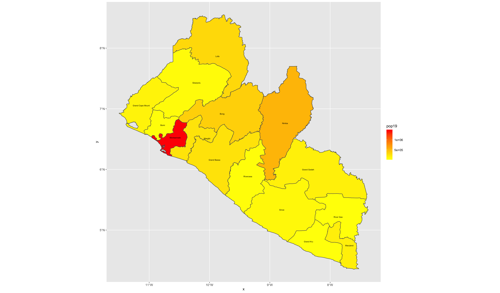

### Challenge Question

Follow the steps from above that you used to produce your plot of Liberia, but instead each team member should use their own selected LMIC country.  Go back to the HDX website and find the population totals for the LMIC country you have selected.

Meet with your group and prepare to present the two best plots for the Friday informal group presentation.  Then as a group, upload all 5 team members plots to \#data100\_igps \(informal group presentations\) by Sunday night.

### Stretch Goal 1

Go back and replicate the step by step instructions from above, but instead of extracting and plotting the values for your LMIC's adm1 subdivisions, do it for adm2.  Set the `fill =`  argument by making it equal to the log transformation of your population variable `log(variable_name)`.   


### Stretch Goal 2

Take your spatial description of population at the district level from above and add the adm1 boundaries, such that you can determine where each district is located.  Be sure to add the `data =`  argument where you specify both your adm1 and adm2 `sf` class object for  each `geom_sf()` function within the `ggplot()` object you are creating.  Set the `size =`  argument for the adm1 object as much smaller than the lines width for the adm2 \(in my plot below they are `.1` and `.65` respectively.  Also be sure to set the `alpha = 0` for the adm1 object, in order to be able to see the districts.

Again, include the `data =`  argument when using the `geom_sf_text()` command in order to add the labels for both the districts and counties.  District labels can be relatively small, perhaps `size = 1.0` while they should be considerable larger for the county labels, possibly along the order of `size = 2.5`. In your `geom_sf_text()` argument for the county lables, set the `alpha = .35`, such that the labels are transparent enough to interpret whats beneath them, while still discenable enough to read.

Change your `scale_fill_gradient()` command to `scale_fill_gradient2()` in order to add a third color and midpoint to the colors mapped to each contiuous value.  Look at the value from the previous scale.  What is the midpoint?  

```r
scale_fill_gradient2(low = "blue", mid="yellow", high="red", midpoint = add_value_here)
```

Add other descriptive elements to your plot, such as labels for axes, title and panel background.

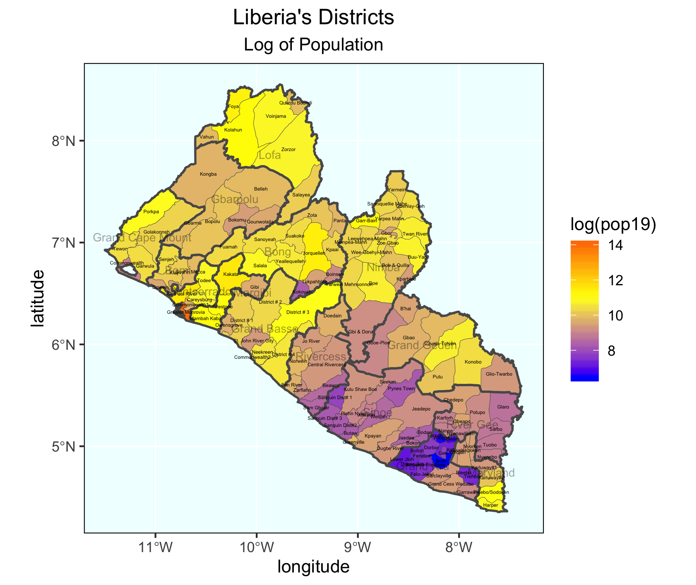

### Stretch Goal 3

Install the package `rayshader::` from Tyler Morgan Wall's github repository.

```r
remotes::install_github("tylermorganwall/rayshader", dependencies = TRUE)
```

Once it has been installed \(it might take a few minutes\), use the `library(rayshader)` command to load the library of functions.  Create a simple ggplot\(\) of adm2 values without any annotations or other descriptive details.  Keep either the `scale_fill_gradient()` or `scale_fill_gradient2()` . Notice how assign my `ggplot()` object to a new object named `gglbr_adm2`.  I used the following code for Liberia.

```r
gglbr_adm2 <- ggplot(lbr_adm2) +
  geom_sf(aes(fill = log(pop19))) +
  scale_fill_gradient2(low = "blue", mid="yellow", high="red", midpoint = 11.0)
```

Finally, create a three dimension plot of all log of density population values by district.  Notice the name of the `ggplot` object I created above is the same object used in the `plot_gg()` command from the `rayshader::` package.

```text
plot_gg(gglbr_adm2, multicore = TRUE, width = 6 ,height=2.7, fov = 70)
```


## Creating a Geometric Bar Plot with your Simple Feature object

In the previous exercise, you extracted population data from a raster, and then aggregated these totals to the first level administrative area of your selected LMIC.  You then added this new column describing the population of each first level administrative subdivision to your simple feature object.  Now we are going to use that newly created column as the basis for generating a geometric bar plot of population, share of population and density by first level adminsitrative subdivision.

Rerun the code you used to create your adm1 `sf` class object in R, including the newly added population column.  Click on the `View()` grid symbol to the right of the data object in the top right, RStudio pane under the environment tab.  When the data viewer appears in the top left pane \(beside your script tab\), it should look something like the following.


Confirm that your `sf` object has the name of each first level administrative subdivision as well as the population data you calculated and introduced.  Then use the `save()` command to save your `sf` object to your working directory.

```r
save(your_adm1_obj, file = "name_of_the_file_you_save.RData")
```

Once you have run the `save()` command you should be able to find your newly created `.RData` file in your working directory.  Please keep in mind that this `.RData` file will be different from the one you previously saved that contained the results from your `extract()` , therefore be certain to name it differently, or else you may write over your previous saved `.RData` file, and effectively erasing it.  Save the `.RData` file containing your  `sf` class object.  Create and name a new script in RStudio, while saving it to your working directory.

As you have done with your prior scripts, start with the `rm()` command to clean the workspace, followed with `install.packages()` which are normally all commented off with the `#` at the beginning of each line and then the `library()` command, in order to load your needed libraries of commands.

```r
rm(list=ls(all=TRUE))

# install.packages("tidyverse", dependencies = TRUE)
# install.packages("sf", dependencies = TRUE)

library(tidyverse)
library(sf)
 
setwd("~/your/working/directory/for_data")
```

Open the `tidyverse::` and `sf::` libraries and set your working directory.  Use the `load()` command to import the `sf` object contained within your  `.RData` file into your workspace.  

```r
load("name_of_the_file_you_saved.RData")
```

After you have executed the above command, you should notice your adm1 `sf` object reappear in the top right pane under the environment tab.  Confirm the newly created `pop19` variable is present in your `sf` class object by using the `View()` command or data viewer.

Add two new columns to your adm1 object.  First will be a column that provides us with the area of each first level administrative subdivision unit in square kilometers, while the second column will describe density of your LMIC.  In order to add these two columns, we will use the `%>%` operator followed by the `mutate()` function.  The `mutate()` command is part of the tidyverse syntax and is used to create a new variable which is calculated from data found in another variable.  As part of the argument within the `mutate()` command, you will give the new column that you are creating a name.

Start with the name of your adm1 object followed by the pipe operator, which you will assign to the same named adm1 object, thus writing over and replacing it with the newly incorporated and created columns. The first newly created column will be named `area`.  In order to calculate this newly created column, we will also use a new command from the `sf` library of functions called `st_area()`.  

```r
yourLMIC_adm1 <- yourLMIC_adm1 %>%
  mutate(area = sf::new_command_here(yourLMIC_adm1))
```

After you execute this command, view the data associated with yout adm1 object and confirm that you have a new column named `area`. 


While these area calculations are accurate, to describe a country in square meters is probably not the most useful unit to select.  Instead of meters squared, we will convert our unit of measurement to square kilometers.  In order to do this, we must first install a new library of functions for use in RStudio.  Install the `units::` package and use the `library()` command in order to make it available for use.

The command we need from the `units::` package is `set_units()`, although this time we will nest our command within a `%>%` to modify the units of measurement from `m^2` to `km^2`.  Notice how the last parenthesis doesn't coorespond with the new command from the `units::` library but rather with the parenthesis from the prior line.  We specify our syntax in this manner since we are applying the `set_units()` command to the results which have been _piped_  from the `st_area()` command.

```r
yourLMIC_adm1 <- yourLMIC_adm1 %>%
  mutate(area = sf::new_command_here(yourLMIC_adm1) %>% 
           units::new_command_here(new_units))
```

The second step in creating our two new columns is to use the `area` variable _on the fly_ to calculate a column named `density` .  This second new column will be the result of our `area` column divided by the `pop19` variable \(which we created in the last exercise\).  

```r
yourLMIC_adm1 <- yourLMIC_adm1 %>%
  mutate(area = sf::new_command_here(yourLMIC_adm1) %>% 
           units::new_command_here(new_units)) %>%
  mutate(density = numerator_variable / denominator_variable)
```

Since we have modfied the units, you should notice both the variables `area` and `density` being described in units of persons per square kilometer.

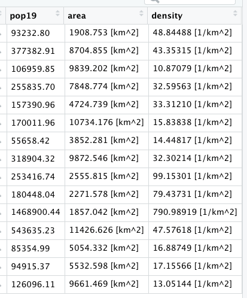

That is all the data we need for now.  Start the creation of your geometric bar plot by first piping `%>%`  your adm1 object to a newly specified `ggplot` object.  Add the aesthetics to your `ggplot` object using the `ggplot()` command and specifying the  `x` and `y` variables from your `sf` class object.  These `x` and `y` objects will be used to plot the values using the `x` and `y` axes \(although we will flip the horizontal to the verticle and _vice-versa_ in a moment\).

Since we are generating a bar plot, we will use the `geom_bar() +` command.  Include the `stat = "identity"` argument to plot the values of individual units of observation, in this case the population of each first level administrative subdivision from your LMIC.  Also add a `color =`  argument to your `geom_bar()` command and set the width of each bar.  Following the `geom_bar()` command, use the `coord_flip()` to flip the county names along the xaxis and give them a verticle disposition.

```r
yourLMIC_adm1 %>%
  ggplot(aes(x=your_adm1_names, y=pop19)) +
  geom_bar(stat="identity", color="color", width=value) +
  coord_flip() +
  xlab("label") + ylab("label")
```


Let's order our counties in accordance with population size from largest to smallest in order to more easily associate the descriptive statistics presented in our bar plot with the spatial descriptive statistics we previously created with our map.  Add a second `%>%` after your adm1 object, where you will reorder the adm1 names based on the variable `pop19`.  Use the `mutate()` command again to write over the existing variable for adm1 names.  The key command you are adding within the `mutate()` argument is `fct_reorder()` which will change the order of the first named variable \(in this case `admin1name`\) based on the descending rank order of the second variable \(`pop19`\).  While I am using the raw population counts to change the county order listed along the vertical axis, you could use also the `area` or `density` variables.

```r
yourLMIC_adm1 %>%
  mutate(admin1name = fct_reorder(admin1name, pop19)) %>%
  ggplot(aes(x=your_adm1_names, y=pop19)) +
  geom_bar(stat="identity", color="color", width=value) +
  coord_flip() +
  xlab("label") + ylab("label")
```

In addition to changing the order of the adm1 names, also add an annotation to each bar that indicates the share of the total population located within that subdivision.  Use the `geom_text()` command to add labels to your bar plot and set the `label =`  argument within the `aes()` parameter in order to calculate each administrative units share of the total population.  Divide the `sum()` of `pop19` variable in the denominator by the raw `pop19`  counts as the numerator.  Place the division of these values within the `percentage()` command from the `scales::` library \(you'll need to install this new package\).

Place the value that describes each administrative unit's share of the total population within the center of each bar using the `position =` .  Set it using the `position_stack(vjust = 0.5)` command with a vertical adjust to the center of the bar \(half the total width\).  Also, decrease the size of the text annotations.

```r
  geom_text(aes(label=percent(pop19/sum(pop19))),
            position = position_stack(vjust = 0.5),
            size=2.0)
```


The last step of creating our geometric bar plot is to add a `fill =`  argument to the `ggplot(aes())` command that will be used to map a color to each counties population total, based on its place along the continuous scale from maximum to minimum.  As we did with our spatial description of population, also add the `scale_fill_gradient()` command to define colors that will correspond to the `low =` and `high =`  values.  Use your assignment operator to create a new ggplot object that will be plotted with spatial description of your LMIC.

```r
yourLMIC_bplt <- yourLMIC_adm1 %>%
  mutate(admin1name = fct_reorder(admin1name, pop19)) %>%
  ggplot(aes(x=admin1name, y=pop19, fill = pop19)) +
  geom_bar(stat="identity", color="color", width=value) +
  coord_flip() +
  xlab("label") + ylab("label") +
  geom_text(aes(label=percent(pop19/sum(pop19))), 
            position = position_stack(vjust = 0.5),
            color="black", size=2.0) +
  scale_fill_gradient(low = "yellow", high = "red")
```


Return to the spatial plot that you created in the last exercise.  Copy the snippet of code that you used with the `geom_sf(aes(fill = pop19))` command in order to plot the population of every first level administrative subdivision along a continuous scale for your LMIC.  Paste this snippet into your new script.  Add a new line to the snippet where you use the `geom_sf_text()` command to set plot the density of each individual adm1 object beneath its name.  Use the `aes(label=command(variable,2)` argument to add the `density` values.  Also, use the `round()` command, so the values from this variable are limited to two decimal points.  Nudge the density values, so they appear beneath each label, while also modifying their size and color.

```r
  geom_sf_text(aes(label=round(add_variable_here, 2)),
            color="color", size=add_size, nudge_y = add_value) +
```


Finally, install the package `ggpubr` and use the command `ggarrange()` to arrange your two plots together side by side.

```r
liberia <- ggarrange(your_spatial_plot, your_bar_plot, nrow = 1, widths = c(2.25,2))
```

Use the `ggtitle()` command to title each plot, and then also use the `annotate_figure()` command to set a common title for the combination of the two descriptive results. 

```r
annotate_figure(liberia, top = text_grob("Liberia", color = "black", face = "bold", size = 26))
```

To save your two plots together, use the `ggsave()` command.  Modify the `width =` and the `height =` commands to set the dimensions for your combined spatial and bar plot.  Use the `dpi =`  command to set the number of dots per inch, or effectively increase the resolution.

```r
ggsave("liberia.png", width = 20, height = 10, dpi = 200)
```


### Project 1. Deliverable

Upload the combined spatial description and geometric bar plot of your selected LMIC to your GitHub repository.  Create a link in your `README.md` file that connects to a webpage that presents your results.  Describe your plot, how you produced it, and any modifications you needed to make.  If you produced any of the stretch goals, include those in your Project 1 individual deliverable.  What observations are you able to make about the spatial description of your LMIC's population?    

Share a link to your Project 1 webpage on the slack channel \#data100\_project1 no later than 11:59PM on Saturday, September 28th.

### Stretch Goal 1

Again create a combined spatial description and geometric bar plot of your LMIC, but this time use the adm2 `sf` object you created in part 2, stretch goal 2.  Use the `save()` and `load()` commands as you did before to import your adm2 object that also includes the newly created poulation column.  Also, again use the `mutate()` command to create new variables that describe `area` and `density` , but this time as new columns in your `adm2` object.    Modify the following script to produce the subsequent geometric bar plot based on your own adm2 `sf` class object.

```r
lbr_adm2 %>%
  ggplot(aes(x=admin1Name, y=pop19, weight = pop19, fill = admin2Name)) +
  geom_bar(stat="identity", color="blue", width=.75) +
  coord_flip() +
  theme(legend.position = "none") +
  geom_text_repel(aes(label = admin2Name),
                  position = position_stack(vjust = 0.5),
                  force = 0.0005,
                  direction = "y",
                  size = 1.35,
                  segment.size = .2,
                  segment.alpha = .4)
  
ggsave("lbr_adm2_bp.png", width = 20, height = 15, dpi = 300)
```

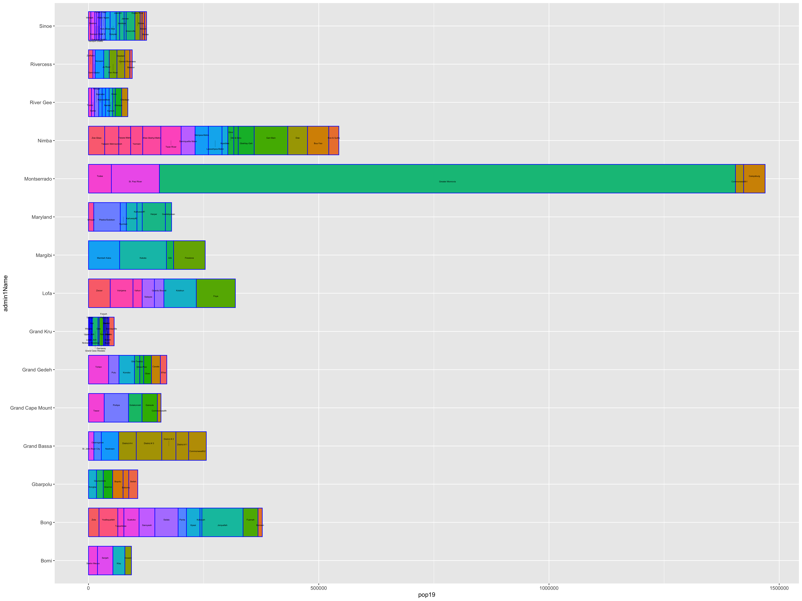

Include this with your deliverable posted to \#data100\_project1.

### Stretch Goal 2

Use the `render_movie("liberia.mp4")` command to create an orbitting video of the three dimension spatial plot you created in part 2, stretch goal 3.  Also, include this with your deliverable posted to \#data100\_project1.

## Acquiring, Modifying and Describing the Data

For the next lab you will use land use and land cover data to describe and analyze your LMIC as well as to model relationships between different large area, geospatial attributes.  To start, create a new folder within your project `data` folder.  This will be the location where you will store a number of different raster files, or geospatial coveriates, that you will use to begin describing and analyzing your LMIC.  I have called my subfolder `lulc` which stands for land use and land cover.

Once you have created your `lulc` folder within your `data` folder, open google and search for the 3 digit ISO code for your seleted low or middle income country.  I simply type _ISO code Liberia_ and hit return in google and the result **LBR**.  Once you have determined your 3 digit ISO code, copy the following webaddress and paste it into your internet browser, BUT modify the last part of the path \(i.e. /ISO/\) and replace it with your LMIC's ISO code.

[ftp://ftp.worldpop.org.uk/GIS/Covariates/Global\_2000\_2020/](ftp://ftp.worldpop.org.uk/GIS/Covariates/Global_2000_2020/)

After entering the path into your browser, you may be asked to enter your name and password in order to access the file transfer protocal \(ftp\) site at ftp.worldpop.uk.org.  Choose guest and then attempt to connect.

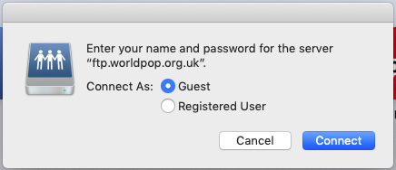

After connecting as a guest you should gain access to the folder at worldpop containing the geospatial covariates, either though the finder, file explorer, or possibly directly through your browser.  My connection protocal in OS X forwards to my finder and opens a new folder from the worldpop server.  This folder on my computer is a kind of window to the WorldPop server location where the geospatial covariates for Liberia are located.

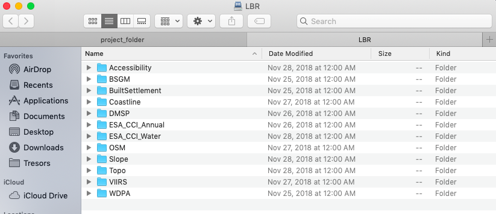

Each of these different folders contains sets of geospatial covariates or raster files that you will need to copy and paste into your `lulc` folder.  To start, open the `ESA_CCI_Annual` folder.  There should be several years within the folder; select the folder with the 2015 data.  Copy all of the files from the `ESA_CCI_Annual` folder to your `lulc` folder.  There will be several, each one being some megabytes to tens of megabytes in size, so be patient when copying the data.  Also keep in mind, it is likely that the WorldPop server will be overloaded with all of your classmates trying to access the data at the same time.  After you have copied the `ESA_CCI_Annual` raster data for 2015, do likewise for the `ESA_CCI_Water` raster that is found within the `DST` folder \(which stands for distance\).  Following the water geospatial covariate layer, continue to the folders that contain topographical and slope data.  Finally, open the `VIIRS` folder and copy the `.tif` file into your `lulc` folder that has the night time lights values for your LMIC.  After you have finished copying all of the files to your `lulc` folder, your data structure should appear similar to the following, except each of your files will begin with the ISO code for your LMIC.


Visit the ESA-CCI Viewer at [https://maps.elie.ucl.ac.be/CCI/viewer/](https://maps.elie.ucl.ac.be/CCI/viewer/) and have a look at the ESA-CCI data you just copied into your data subdirectory.  In the bottom left hand corner of the viewer you will find a legend for the map.  Open the legend and consider the values in the left hand column as well as each one's corresponding label.  Each value cooresponds to the three digit code found within the raster files your just copied into your `lulc` folder.  For example, the file `lbr_esaccilc_dst150_100m_2015.tif` is the geospatial covariate layer for _Sparse vegetation \(tree, shrub, herbaceous cover\) \(&lt;15%\)_ since the third part of the file name **dst150** cooresponds to the 150 value in the legend.  As before, the dst part of the filename again stands for distance, since each gridcell will provide a distance measure.  Save the legend to your data folder for reference, since it is likely you will need it again later.

Once all the data is properly situated in your folder, open RStudio and create a new script.  Use the `library()` command to load the `raster`,`sf`,`tidyverse`, `doParallel` and `snow` libraries of functions just as we did before.  Set your working dirctory to your data folder.  Also, be sure to `load()` the `sf` files you previously created for your LMIC's adm1 & adm2, each one with the population data variable you created.

```r
rm(list=ls(all=TRUE))

# install.packages("raster", dependencies = TRUE)
# install.packages("sf", dependencies = TRUE)
# install.packages("tidyverse", dependencies = TRUE)
# install.packages("doParallel", dependencies = TRUE)
# install.packages("snow", dependencies = TRUE)

library(sf)
library(raster)
library(tidyverse)
library(doParallel)
library(snow)

setwd("/the_path/to_your/project_folder/with_data/")

### Import Administrative Boundaries ###

load("lbr_adms.RData")
```

With your working directory set to the `lulc` folder where your geospatial covariate rasters are located, you will write a command that imports all of the `esaccilc_dst` files into your R workspace, at the same time, while also stacking each rasters on top of one another, until you have formed what is called a `RasterStack`.  To do this first start with the `list.files()` command and create an object named `f` that will contain the names of all of the `esaccilc_dst` files in your `lulc` folder.  It's probably possible to import ALL of your raster files from the `lulc` folder by identifying a common pattern to ALL the geospatial covariate files, but for now we will start with just the files containing the `esaccilc_dst` `.tif` pattern in their file name.  The `recursive = TRUE` argument will enable the `list.files()` command to search not only in the parent `lulc` directory, but also in any child subdirectories.

```r
f <- list.files(pattern="add_file_name_pattern_here", recursive=TRUE)
```

After properly executing the above command, you should notice the object `f` appear in your top right pane.  It is also possible to check the contents of `f` which should be the names of all the `esaccilc_dst` files. 

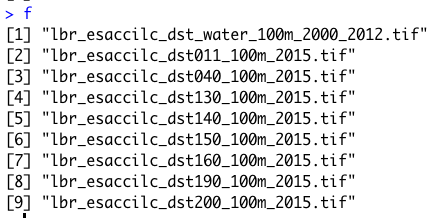

The object `f` is needed to identify all of the `raster` objects you will stack one on top of another until you have created your `RasterStack`.  You may recall in project 1 using the `raster()` command to import a `.tif` into RStudio.  This time you will use both the `raster()` command on the inside of a function as well as the `stack()` command on the outside of the function.  In combination with the `lapply()` command \(which stands for list apply\), the `raster()` command will iterate through your `f` object, identifying the name of each `.tif` file from your `lulc` folder, until each one has been imported, and then with the `stack()` command, stack each raster one by one, until your formal `RasterStack` class object has been created.  The `function(i)` part of the argument is used to indicate which function will be used to iterate the number of times as objects in your `i` argument, which in this case is equal to the number of rows in `f`.

```r
lulc <- your_outside_cmd(lapply(f, function(i) your_inside_cmd(i, band=1)))
```

Once you have executed your `stack()` command to create your `RasterStack` object in your workspace, check to confirm the contents of your `lulc` object.


You will notice that the `RasterStack` object not only is comprised of nearly 25 million gridcells in this instance, there is also a new dimension to the object named `nlayers`, which is 9.  Within this `RasterStack` is the `names` identifier, with each name representing one of the files we copied from the WorldPop website into your `lulc` data folder and then imported into RStudio.  While the name of each layer is provided on the `names` row having been directly assigned from each file name, specifically the names themselves are very long and confusing.  Rename each layer, by again identifying patterns from the object `f` we created, and replacing the superfluous parts with an empty space or `""`.  You will need to retain the part of each file name that begins with `dst` and is then followed by three digits.  For example, with the file name `lbr_esaccilc_dst040_100m_2015.tif` you will need to retain everything BUT the `dst040` part of the name.  To do this, you will first want to replace the common pattern from the last part of the file name sequence with a `""`. Then you will want to replace the first part of the common pattern from the file name sequence with a `""`.  You will do this by nesting the two commands within each other.

```r
nms <- sub("last_part.tif", "", sub("first_part_", "", object_with_the_file_names))
```

Type `nms` directly into the console to confirm you have correctly created this new object that contains the truncated form of each raster layer name you plan to assign.


The first file that contains the distance to water layer had a slightly different naming pattern, but don't worry about it just yet.  Go ahead and assign it as is, but keep in mind you will also replace that layer's name momentarily.

Once you have created your `nms` object that contains each layer's name, use the `names()` command with your `lulc` object as the object and simply assign the names using `nms`.

```r
add_command_here(your_RasterStack_obj) <- object_with_truncated_names
```

Confirm you have correctly used the `names()` command with your `lulc` object to rename each layer by viewing the `RasterStack` in the console.  You should notice that there are several new names listed for each layer in your `RasterStack`.  


There are still three more raster `.tif` files in your `lulc` data folder that need to be imported and added as new layers to your `lulc` `RasterStack` object.  Import the topography, slope and night time lights layers into R by using the `raster()` command as you have done in the past.

```r
topo <- raster("lbr_srtm_topo_100m.tif")
slope <- raster("lbr_srtm_slope_100m.tif")
ntl <- raster("lbr_viirs_100m_2015.tif")
```

Once you have those three new `raster` class objects in your R workspace, use the `addLayer()` command to combine all twelve layers into a single `RasterStack`.  To add these three layers to your existing `RasterStack` with 9 layers first specify your existing object, then follow it with the three newly imported geospatial covariate rasters you plan to stack on top of the existing nine.

```r
lulc <- command(existing_stack, new_raster1, new_raster2, new_raster3)
```

Manually update the names for the water layer as well as each of the three newly stacked rasters.  Again use the `names()` command with your `RasterStack` object, but this time specify which layers will have their names modified and updated.  In this case you want to update the names of the first layer as well as layers ten through twelve.  Using the `[]` subscripting operators with the `c()` combine command is a powerful way to traverse an object in order to pinpoint your specified command.  In this case it is important that the number of names being modified \(as specified by the 1, 10, 11 & 12 on the left hand side inside the subscripting operators\) is the same length as the number of names being assigned \(specified by the names water, topo, slope and ntl within the combine command on the right hand side\).

```r
add_command_here(object_name)[c(1,10:12)] <- c("water","topo","slope", "ntl")
```

With all of the geospatial covariates in place as separate layers within your `RasterStack` , you are now able to plot each one.  Have a look at a few of the different layers using the `plot()` command with the `[[layer_number]]` double subscripting operators.  Using the `[[]]` double subscripting operator will identify entire lists, rather than rows, objects and/or observations from within a `data.frame`.  Try adding the `adm1` or `adm2` `sf` object to your plot.  Also use the `contour()` command to add contour lines to your topographic map.

```r
plot(lulc[[12]])
```


```r
plot(lulc[[8]])
plot(st_geometry(lbr_adm1), add = TRUE)
```

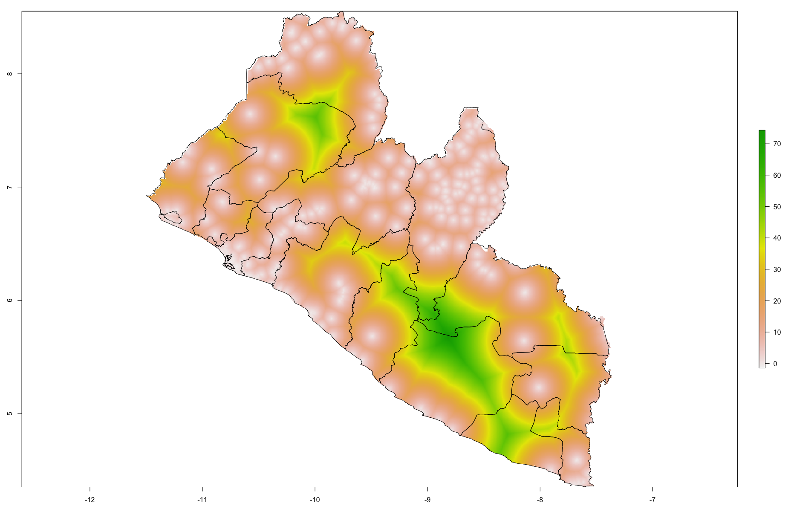

```r
plot(lulc[[10]])
contour(lulc[[10]], add = TRUE)
```


### Extracting Land Use and Land Cover Data for Description

Now that you have your `lulc` `RasterStack` in place, use the `extract()` command to assign the adm2 ID to each gridcell.  Just as you did before, `save()` your `data.frame` object so you don't have to unnecessarily rerun the computationally expensive `extract()` command again and again.

```r
ncores <- detectCores() - 1
beginCluster(ncores)
lulc_vals_adm2 <- raster::extract(lulc, lbr_adm2, df = TRUE)
endCluster()
save(lulc_vals_adm2, file = "lulc_vals_adm2.RData")
```

Comment off these 5 lines using the `#`, once the `extract()` has finished, and then add the `load("name_of_you_data_file.RData")` command to reload the data the next time you run your script.

Use the `sum()` command with the `summarize_all()` command to sum all of the values within each adm2 subdivision for each of the twelve different raster layers.  The `summarize_all()` command is  different than the one used in the previous project, since you will summarize all of the geospatial covariates at once rather than specifying each one at a time \(although it is still possible, it would just take a lot more typing\).

```r
lulc_ttls_adm2 <- lulc_vals_adm2 %>%
  group_by(add_column_name) %>%
  summarize_all(sum, na.rm = TRUE)
```

Your object `lulc_ttls_adm2` should have the same number of rows as your `adm2` `sf` object as well as thirteen variables, one for each of the geospatial covariates obtained from WorldPop and the `ID` column.  You will notice that the names of each column in your `lulc_ttls_adm2` object will correspond with the names of each layer from your `RasterStack`.


Now use the `bind_cols()` command to bind each of these thirteen rows to the eleven existing variables in your adm2 object.

```r
lbr_adm2 <- add_command_here(lbr_adm2, lulc_ttls_adm2)
```

Your adm2 `sf` object should now have something on the order of 24 variables.  To start with your description and analysis of the land use and land cover data, consider first the `pop19` variable you created in the last project.  Use `ggplot()` to produce a histogram using the `geom_histogram() +` command.

```r
ggplot(lbr_adm2, aes(pop19)) +
  geom_histogram()
```

Compare how the histogram plot changes after adding the `log()` command to the `pop19` variable within the `aes()` argument.

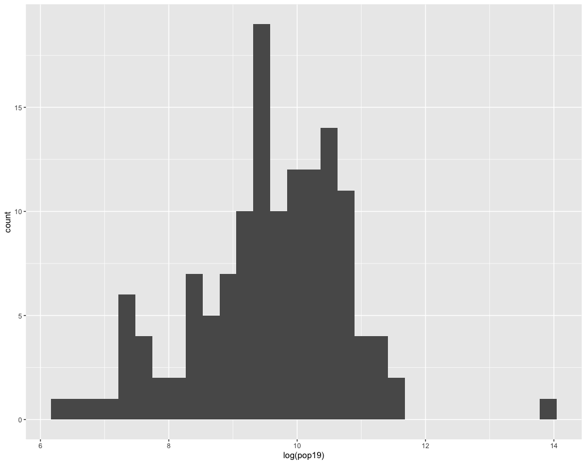

Likewise, do the same with the `geom_density() +` command, also adding the `log()` command by wrapping the `pop19` variable within it.

```r
ggplot(lbr_adm2, aes(pop19)) +
  geom_density()
```

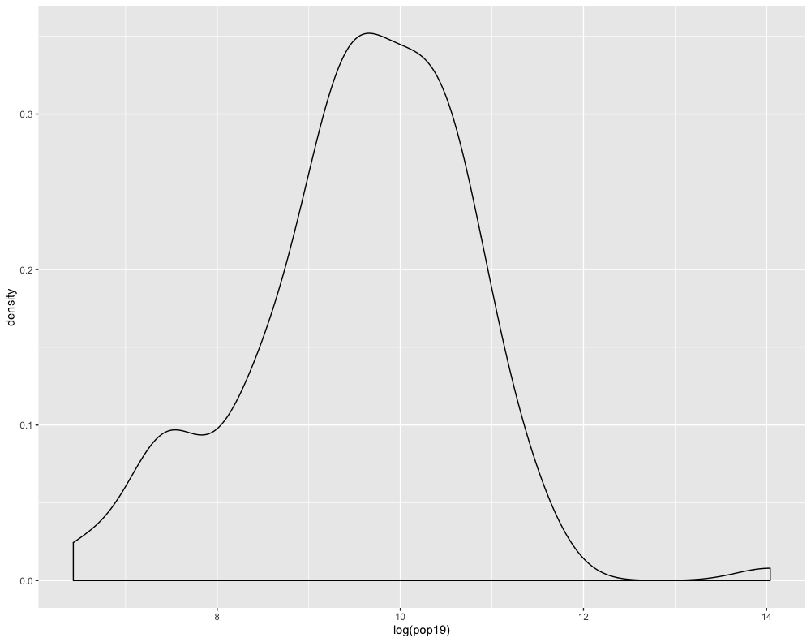

You will notice that the density plot has a similar profile as the histogram.  We can compare the two by overlapping the histogram with the density plot or probability density function \(pdf\).  In order to transform a histogram into a density plot, the density function uses somethings called a **kernel** and **bandwidth** to smooth the data over the space.  A good analogy for thinking about how a histogram transforms into a pdf is to think of each verticle bar as stacked, square pieces of chocolate, and then you took a hairdryer to warm the chocolate squares until they melted and smoothed out over the space.  While there are statistical methods that can be used to modify the shape and profile of the pdf function, essentially the area of the histogram and the density plot should be nearly the same.

```r
ggplot(lbr_adm2, aes(pop19)) +
  geom_histogram(aes(y = ..density..), color = "black", fill = "white") + 
  geom_density(alpha = 0.2, fill = "#FF6666") + 
  theme_minimal()
```

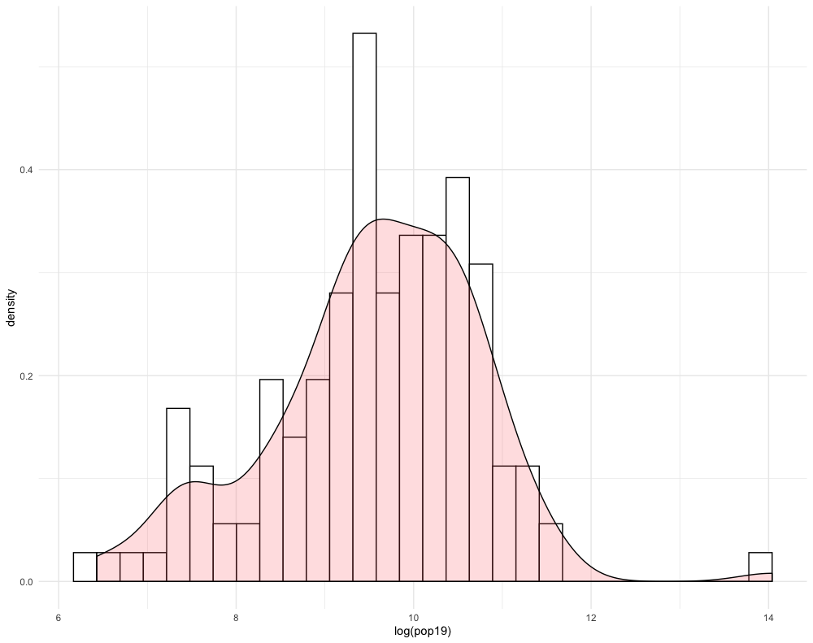

Create another histogram with the pdf overlapping, but this time use a different variable.  For example in the following plot, I have used the `ntl` variable, without the `log()` function added.


### Challenge Question

Follow the steps from above used to produce the plots describing Liberia, but instead each team member should use their own selected LMIC country.  Produce **two combined histogram** **with** **density plots** that describe the correlationship between population at the adm2 level as a dependent variable and two of the other land use land cover variables you added.  You are also welcome to use density as a variable.