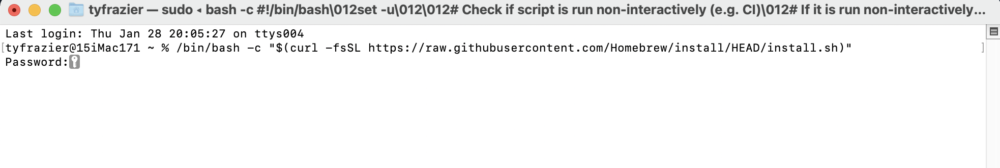
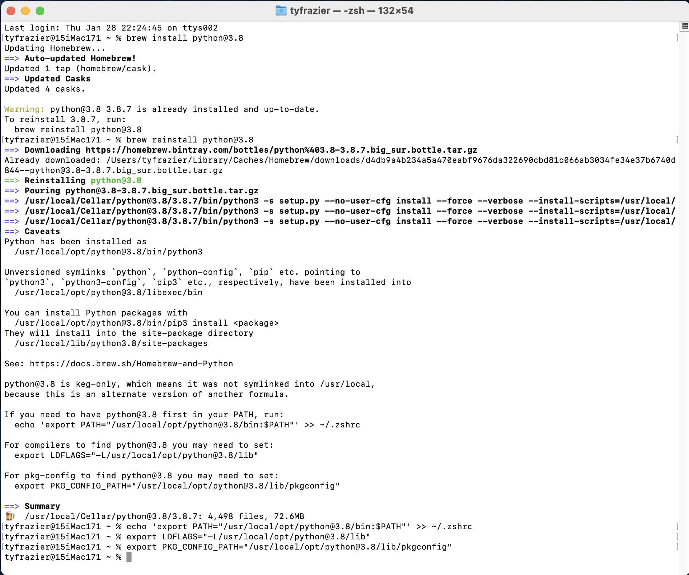
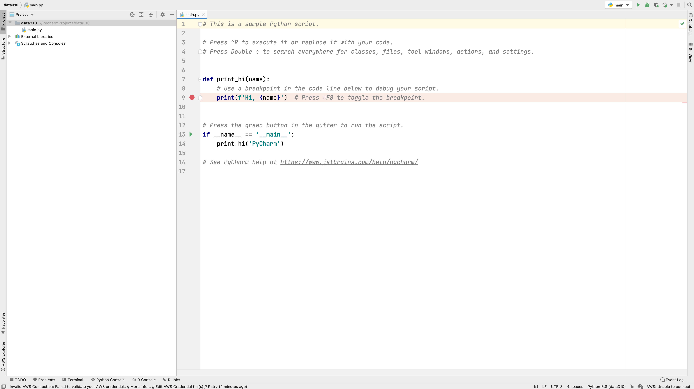
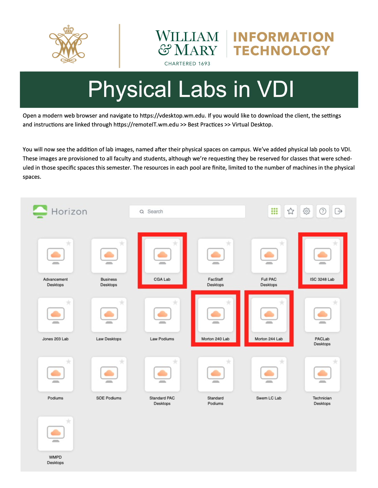

# Local Installation of Python and PyCharm

## Using a Package Manager

[Package managers or package management systems](https://en.wikipedia.org/wiki/Package_manager) are an effective way to keep track and automate the process of installing, upgrading, configuring and removing computer programs for a computer operating system consistently.  While there are several possible options available, there are two recommended options, depending on the operating system you are running on your local machine.  It is worth noting that a package manager is not 100% necessary, it is likely equally possible to download the software installation file and run it, in order to install any of the needed programs.  The package manager itself, requires a bit more investment on the front-end in order to implement and understand, but ultimately in the long run, this investment can pay off with a more smoothly running operating system and encountering few technical problems and difficulties.

## Installing Homebrew for Mac Operating Systems

One of the most preferred Mac OSX package managers is [homebrew](https://brew.sh).  To install homebrew on your Mac, go to the homebrew webpage, copy the link beneath where it says "Install Homebrew" and then paste it into your terminal.  Your operating system may ask you to provide your password in order to install the package manager with administrative privileges.



One of the first things you will want to do with your new homebrew installation is to run a few commands in order to get your system up to date, cleaned up and ready to go.

```shell
% brew upgrade 
```
* Upgrades your homebrew installation to the current version
```shell
% brew update
```
* Updates the package installation formulas
```shell
% brew cleanup
```
* checks system links and removes them as needed
```shell
% brew doctor
```
* Checks the installation of your programs for possible configuration conflicts.  Ideally this command returns "ready to brew" although some possible warnings can be laborious to investigate and fix, and may require further study for novices.

Once you have homebrew installed you can start by installing python.  Go back to the main homebrew page and have a look at the [Homebrew Packages](Homebrew Packages), formulas that are available.  Scroll down through the list until you find the formulas for python.  The basic syntax for installing a package using homebrew is `brew install [package name here]`.

The latest version of python is 3.9.1, although if you are planning to use the tensorflow library of functions (to employ applied machine learning methods for example), at this time, the tensorflow library is only functional up to python version 3.8.7.  I will start with the python version 3.8.7, which can be installed using the basic homebrew command.  If you find the [python@3.8](https://formulae.brew.sh/formula/python@3.8) formula page, you can simply copy the formula to your clipboard and paste into your terminal.

```shell
brew install python@3.8
```

From the following image of my terminal you can see that I already have python 3.8.7 installed, but none the less, I have decided to go ahead and reinstall again for posterity. There are a number of symlinks that probably need to be addressed, which also show up when I run `brew doctor`, but I'm simply going to ignore these for the time being.  At the end, I did go ahead and run the command that exported a path to my configuration file (in my case zshell) and likewise did for compilers and also package configuration.



Once you have python installed, next you can proceed to install the Jetbrains IDE (integrated developer environment)  that has been created for use with python called PyCharm.  We are going to select the professional version, and then register with JetBrains as educational users, which should offers us nearly the full functionality of the IDE.

```shell
brew install pycharm
```

Once you have installed PyCharm, you should be able to find it in your applications folder.  You are welcome to go ahead and open it and look for the add license tab.  Before entering a new license for your PyCharm software you will need to create a JetBrains account.  You can do so at the following website.

[JetBrains Products for Learning](https://www.jetbrains.com/shop/eform/students)

It might take a few minutes to complete the registration, but once finished you should be able to enter your e-mail and password in order to activate PyCharm.  Once you have activated your software, and started up PyCharm, you should see a "Welcome to PyCharm" window where you can open a new project.  Go ahead and select "new project."  Following this step, you should see a window that has a similar appearance to the following image.  Choose "pure python" and give your project a name there it will be located within your `PycharmProjects` home folder. I will assign the name of my course and select the "virtual environment" and python@3.8 as the base interpreter for this newly created project.


Once you have created your new project and designated the python interpreter, your integrated developer environment should appear.



If your PyCharm IDE appears similar to the previous image, you are pretty much ready to get started using python!

## Installing Chocolatey for Windows Operating Systems

Chocolatey is a relatively new package manager that is similar to homebrew but is designed for use with the Windows operating system rather than a Mac.  To install chocolatey on your Windows computer go to the [Chocolatey installation webpage](https://chocolatey.org/install) and follow the instruction under "Step 2."

Chocolatey functions in a manner very similar to homebrew (as described in the previous step), although instead of entering your commands at the terminal of a unix shell, on a windows system you will enter the installation command using the powershell.  Copy the command using your clip board and paste it into your powershell.

Once you have the Chocolatey package manager in place, you should be able to begin installing software using the chocolatey formulas.  Have a look at the [python 3.8.7 formula page](https://chocolatey.org/packages/python3/3.8.7) and copy the formula onto your clip board and then enter it into your powershell.

```shell
choco install python3 --version=3.8.7
```
Which should effectively install python to your system.

Again, in a manner that is quite similar to applying a homebrew installation formula, go ahead and install the PyCharm IDE using that particular formula.

```shell
choco install pycharm
```

Once you have installed the PyCharm IDE to your operating system, follow the instructions above under the homebrew installation in order to register with Jetbrains and to obtain a student educational license.  After licensing your product, go ahead and create a new project, select a virtual python interpreter and open your PyCharm IDE!

## Downloading Python and Pycharm installation files

Rather than using a package manager, you can also simply go to the python website and find the correct version, download and install.

[Python Installation Website](https://www.python.org/downloads/)

[Python 3.8.7](https://www.python.org/downloads/release/python-387/)

Once you have Python installed it is also possible to download and install PyCharm from the JetBrains website.

[PyCharm Professional](https://www.jetbrains.com/pycharm/download/#section=mac)

Once PyCharm is installed you should find it in your applications folder (Mac) or search for it in your Windows search box (bottom left-hand corner).  As was described above, you will want to register your product, obtain a license and then enter that license with your local installation.  Once you have registered your product, give your Pure Python project a name, select the virtual environment, your base interpreter (Python 3.8.7) and then create your new project.

# Other options: Jupyter Notebooks, Google Colab & accessing a lab computer through the William & Mary Virtual Desktop

[Jupyter notebooks](https://en.wikipedia.org/wiki/Project_Jupyter) employ a slightly different approach to running python or alternatively R or Julia.  An advantage of using a Jupyter Notebook is that the installation process is typically removed from the local workstation and executed on a remote server.  Project notebooks employ cells and integrated text that sequentially alternating instruction and execution of code in order to faciliate teaching and learning.  Jupyter notebooks are a popular choice for running python and we have a local server that is available for your use and can be found at the following webaddress.

[jupyterhub@wm](https://jupyterhub.wm.edu/)

While the configuration may be slightly different in appearance, with your professional version of PyCharm and your educational license, you should be able to run `.ipynb` file types (jupyter notebooks) within your PyCharm IDE.

Another possible option for remote python execution is Google developers free Jupyter notebook environment called Colaboratory or often just simply Google Colab.  Like the jupyter hub installation, google colab also runs in a webbrowser and is accessed via the following address.

[Google Colaboratory](https://colab.research.google.com/notebooks/intro.ipynb)

Both Jupyter notebooks and Google Colaboratory offer simple, remote interfaces that readily enable access to python from the outset.

Finally, the William & Mary IT department offers virtual access to most of our physical labs using a virtual desktop.



Point your browser to the web address in the image above and follow the instructions in order to gain remote access to a lab computer on campus.  The computers in ISC 3248 should have Python and PyCharm available for your use.  For additional instructions please see the following link.

[general VDI instructions](https://www.wm.edu/offices/it/services/network/virtualdesktop/index.php)

Finally, if you wish to simply visit the computer lab in ISC3 #3248 (or elsewhere on campus) and open PyCharm on a local machine at that location that is also an option.