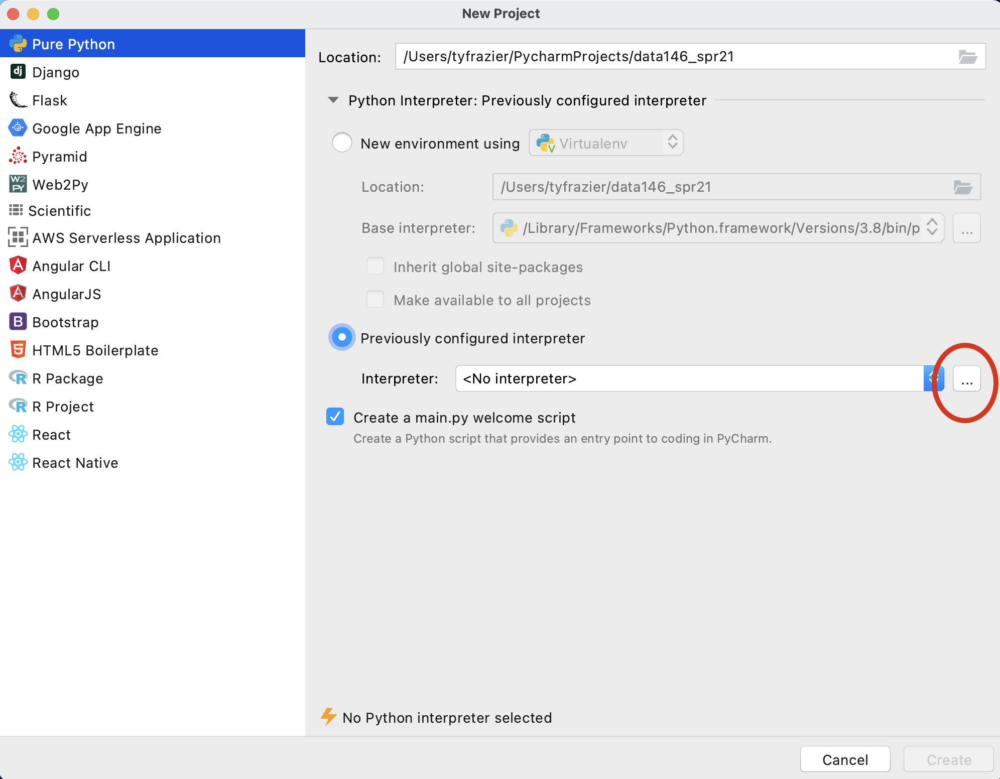

# Local Installation of Python and PyCharm

## Downloading Python and Pycharm installation files

In order to install python, you can simply go to the python website and find the correct version, download and install it.  The latest version of python is 3.9.1, although if you are planning to use the tensorflow library of functions (to employ applied machine learning methods for example), at this time, the tensorflow library is only functional up to python version 3.8.7.  For our purposes let's just stick with Python 3.8.7, although I will also provide the main link below.

[Python Installation Website](https://www.python.org/downloads/)

[Python 3.8.7](https://www.python.org/downloads/release/python-387/)

Once you have Python installed, go ahead and open the application and run it.  On a Mac, you should find a Python 3.8 folder within your applications folder.  If you run the IDLE app, a shell window running python 3.8.7 should open.  Later you may need to know the path to your python 3.8.7 executable file, so go ahead and enter the following commands and copy the output.

```python
import sys
print(sys.executable)
```

The interpreter should return the path to the executable file being used to run this version of python.  Make a note of that path for later use.


Next proceed to install the Jetbrains IDE (integrated developer environment)  that has been created for use with python called PyCharm.  We are going to select the professional version, and then register with JetBrains as educational users, which should offer us nearly the full functionality of the IDE.

[PyCharm Professional](https://www.jetbrains.com/pycharm/download/#section=mac)

Once PyCharm is installed you should find it in your applications folder (Mac) or search for it in your Windows search box (bottom left-hand corner).  In order to gain full functionality of PyCharm, you will want to register your product as a student license, which you should be able to accomplish from the "Welcome to PyCharm" screen.  Before entering a new license for your PyCharm software you will need to create a JetBrains account.  You can do so at the following website.

[JetBrains Products for Learning](https://www.jetbrains.com/shop/eform/students)

Once you have registered your product, from the Welcome to PyCharm screen, select New Project.  You should see a window that gives you the option to name your new project and select an interpreter.  Since you just installed python 3.8.7 we should find that interpreter and add it to your newly created project.  To do this select "previously configured interpreter" and select the ... off to the right. 



On this screen, again click the ... off to the right of the pull down to select your "Interpreter" in the "Virtualenv Environment" pane.  Recall the path you previously recorded from when you initially installed python 3.8.7. and recalled the path the `sys/executable`.  Find this file using the "Select Python Interpreter" window and then select "OK".

 

Upon completing the previous steps, you should return to the "New Project" window.  Go ahead and create your new python project.


Once you have created your new project and designated the python interpreter, your integrated developer environment should appear.  If you left the "create a main.py welcome script" check box selected, then you should also have a `main.py` script in the right pane of your console.  To execute this script, select the entire code either by highlighting it with your cursor or using command-A, and then right click on the selected code select the option "Execute Selection in Python Console".


Alternatively you can also run your selected code by executing the option-shift-E combination of keys.  If your console returns a "Hi, PyCharm" then you have successfully installed Python and PyCharm!

## Remote access via William & Mary Virtual Desktop

A good back-up option for running Python and PyCharm is to remotely access a laboratory computer.  The William & Mary IT department offers virtual access to most of our physical labs using a virtual desktop.


Point your browser to the web address in the image above and follow the instructions in order to gain remote access to a lab computer on campus.  The computers in ISC 3248 should have Python and PyCharm available for your use.  For additional instructions please see the following link.

[general VDI instructions](https://www.wm.edu/offices/it/services/network/virtualdesktop/index.php)

Also, if you wish to simply visit the computer lab in ISC3 #3248 (or elsewhere on campus) and open PyCharm on a local machine at that location that is also an option.

## Remote access via Jupyter Notebooks or Google Colab

[Jupyter notebooks](https://en.wikipedia.org/wiki/Project_Jupyter) employ a slightly different approach to running python or alternatively R or Julia.  An advantage of using a Jupyter Notebook is that the installation process is typically removed from the local workstation and executed on a remote server.  Project notebooks employ cells and integrated text that sequentially alternate instruction and execution of code in order to facilitate teaching and learning.  Jupyter notebooks are a popular choice for running python, and we have a local server that is available for your use and can be found at the following web address.

[jupyterhub@wm](https://jupyterhub.wm.edu/)

Another possible option for remote python execution is Google developers free Jupyter notebook environment called Colaboratory or often just simply Google Colab.  Like the jupyter hub installation, google colab also runs in a webbrowser and is accessed via the following address.

[Google Colaboratory](https://colab.research.google.com/notebooks/intro.ipynb)

Both Jupyter notebooks and Google Colaboratory offer simple, remote interfaces that readily enable access to python from the outset.

One final note regarding jupyter notebooks.  With your professional version of PyCharm, you should be able to run and modify `.ipynb` file types (jupyter notebooks) within your PyCharm IDE.  

## More advanced option: using a Package Manager

[Package managers or package management systems](https://en.wikipedia.org/wiki/Package_manager) are an effective way to keep track and automate the process of installing, upgrading, configuring and removing computer programs for a computer operating system.  While there are several possible options available, there are two recommended options, depending on the operating system you are running on your local machine.  The package manager itself, requires a bit more investment on the front-end in order to implement and understand, but ultimately in the long run, this investment can pay off with a more smoothly running operating system and encountering fewer technical complications and conflicts.

## Installing Homebrew for Mac Operating Systems

One of the most preferred Mac OSX package managers is [homebrew](https://brew.sh).  To install homebrew on your Mac, go to the homebrew webpage, copy the link beneath where it says "Install Homebrew" and then paste it into your terminal.  Your operating system may ask you to provide your password in order to install the package manager with administrative privileges.


One of the first things you will want to do with your new homebrew installation is to run a few commands in order to get your system up to date, cleaned up and ready to go.

```shell
% brew upgrade 
```
* Upgrades your homebrew installation to the current version
```shell
% brew update
```
* Updates the package installation formulas
```shell
% brew cleanup
```
* checks system links and removes them as needed
```shell
% brew doctor
```
* Checks the installation of your programs for possible configuration conflicts.  Ideally this command returns "ready to brew" although some possible warnings can be laborious to investigate and fix, and may require further study for novices.

Once you have homebrew installed you can start by installing python.  Go back to the main homebrew page and have a look at the [Homebrew Packages](Homebrew Packages), formulas that are available.  Scroll down through the list until you find the formulas for python.  The basic syntax for installing a package using homebrew is `brew install [package name here]`.

The latest version of python is 3.9.1, although if you are planning to use the tensorflow library of functions (to employ applied machine learning methods for example), at this time, the tensorflow library is only functional up to python version 3.8.7.  I will start with the python version 3.8.7, which can be installed using the basic homebrew command.  If you find the [python@3.8](https://formulae.brew.sh/formula/python@3.8) formula page, you can simply copy the formula to your clipboard and paste into your terminal.

```shell
brew install python@3.8
```

From the following image of my terminal you can see that I already have python 3.8.7 installed, but none the less, I have decided to go ahead and reinstall again. There are a number of symlinks that probably need to be addressed, which also show up when I run `brew doctor`, but I'm simply going to ignore these for the time being.  At the end, I did go ahead and run the command that exported a path to my configuration file (in my case zshell) and likewise did for compilers and also package configuration.  Just as you did above, you will want to identify the location of your newly installed python interpreter for use when creating your new python project and initially selecting an interpreter.


Once you have python installed, next you can proceed to install the Jetbrains IDE (integrated developer environment)  that has been created for use with python called PyCharm.  We are going to select the professional version, and then register with JetBrains as educational users, which should offer us nearly the full functionality of the IDE.

```shell
brew install pycharm
```

Once you have installed PyCharm, you should be able to find it in your applications folder.  You are welcome to go ahead and open it and look for the add license tab.  Before entering a new license for your PyCharm software you will need to create a JetBrains account.  You can do so at the following website.

[JetBrains Products for Learning](https://www.jetbrains.com/shop/eform/students)

It might take a few minutes to complete the registration, but once finished you should be able to enter your e-mail and password in order to activate PyCharm.  Once you have activated your software, and started up PyCharm, you should see a "Welcome to PyCharm" window where you can open a new project.  Go ahead and select "new project."  Following this step, you should see a window that has a similar appearance to the following image.  Choose "pure python" and give your project a name there it will be located within your `PycharmProjects` home folder. I will assign the name of my course and select the "virtual environment" and python@3.8 as the base interpreter for this newly created project.


Once you have created your new project and designated the python interpreter (see the steps above), your integrated developer environment should appear.


If your PyCharm IDE appears similar to the previous image, you are pretty much ready to get started using python!

## Installing Chocolatey for Windows Operating Systems

Chocolatey is a relatively new package manager that is similar to homebrew but is designed for use with the Windows operating system rather than a Mac.  To install chocolatey on your Windows computer go to the [Chocolatey installation webpage](https://chocolatey.org/install) and follow the instruction under "Step 2."

Chocolatey functions in a manner very similar to homebrew (as described in the previous step), although instead of entering your commands at the terminal of a unix shell, on a windows system you will enter the installation command using the powershell.  Copy the command using your clip board and paste it into your powershell.

Once you have the Chocolatey package manager in place, you should be able to begin installing software using the chocolatey formulas.  Have a look at the [python 3.8.7 formula page](https://chocolatey.org/packages/python3/3.8.7) and copy the formula onto your clip board and then enter it into your powershell.

```shell
choco install python3 --version=3.8.7
```
Which should effectively install python to your system.

Again, in a manner that is quite similar to applying a homebrew installation formula, go ahead and install the PyCharm IDE using that particular formula.

```shell
choco install pycharm
```

Once you have installed the PyCharm IDE to your operating system, follow the instructions above under the homebrew installation in order to register with Jetbrains and to obtain a student educational license.  After licensing your product, go ahead and create a new project, select a virtual python interpreter and open your PyCharm IDE!